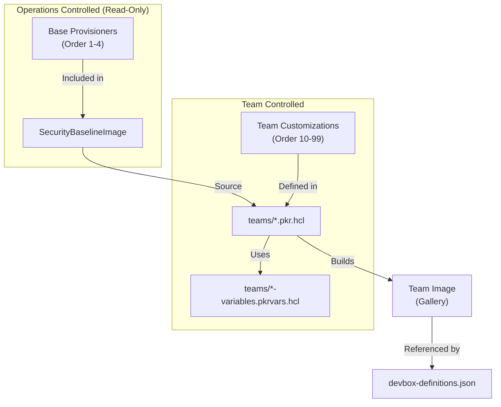
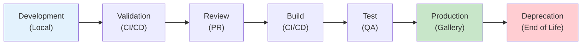

# Developer Image Guide - Microsoft DevCenter Solution

**Document Version:** 1.0  
**Last Updated:** January 28, 2026  
**Classification:** Internal  
**Status:** Draft

---

## Table of Contents

1. [Overview](#overview)
2. [Getting Started](#getting-started)
3. [Image Development Lifecycle](#image-development-lifecycle)
4. [Building Images](#building-images)
5. [Testing Your Image](#testing-your-image)
6. [Pull Request Requirements](#pull-request-requirements)
7. [Updating Definitions](#updating-definitions)
8. [Troubleshooting](#troubleshooting)
9. [Best Practices](#best-practices)
10. [FAQ](#faq)

---

## Overview

This guide is for **development teams** who create and maintain custom Dev Box images. It covers the operational procedures for building, testing, and deploying team-specific images.

> **Note:** This guide focuses on developer responsibilities. For IT operations procedures (monitoring, incidents, infrastructure), see the [Operations Guide](OPERATIONS-GUIDE.md).

### Who Should Use This Guide

| Role | Responsibilities |
|------|-----------------|
| **Team Developers** | Build and test custom images for their team |
| **Team Leads** | Review and approve image changes |
| **DevOps Engineers** | Maintain CI/CD pipelines for image builds |

### What You Can Customize

| ✅ You Can | ❌ You Cannot |
|-----------|--------------|
| Add development tools (IDEs, SDKs, CLIs) | Modify security baseline settings |
| Install team-specific software | Disable Windows Defender or Firewall |
| Configure developer preferences | Change Intune enrollment settings |
| Add VS Code extensions | Bypass Operations base provisioners |
| Install Chocolatey packages | Use a different source image |

### Architecture Overview



---

## Getting Started

### Prerequisites

Before building images, ensure you have:

| Requirement | Version | Installation |
|-------------|---------|--------------|
| **Azure CLI** | 2.50+ | `winget install Microsoft.AzureCLI` |
| **Packer** | 1.9+ | `choco install packer` |
| **Git** | Latest | `winget install Git.Git` |
| **PowerShell** | 7.0+ | `winget install Microsoft.PowerShell` |
| **Azure Subscription Access** | - | Contact Infrastructure Team |

### Initial Setup

```powershell
# 1. Clone the repository
git clone https://github.com/aj-enns/microsoft.devcenter.git
cd microsoft.devcenter

# 2. Login to Azure
az login
az account set --subscription "<your-subscription-id>"

# 3. Navigate to images directory
cd images/packer

# 4. Create your variables file from example
cp teams/vscode-variables.pkrvars.hcl.example teams/vscode-variables.pkrvars.hcl

# 5. Edit the variables file with your values
code teams/vscode-variables.pkrvars.hcl
```

### Configure Variables File

Edit your `*-variables.pkrvars.hcl` file:

```hcl
# Required variables
subscription_id       = "xxxxxxxx-xxxx-xxxx-xxxx-xxxxxxxxxxxx"
resource_group_name   = "rg-devbox-images"
gallery_name          = "DevBoxGallery"

# Image versioning
baseline_image_version = "1.0.0"    # SecurityBaselineImage version (check with Ops)
image_version          = "1.0.1"    # Your team's image version

# Build configuration
location = "eastus"
vm_size  = "Standard_D2s_v3"
```

---

## Image Development Lifecycle

### Version Numbering

Use [Semantic Versioning](https://semver.org/):

| Version Part | When to Increment | Example |
|--------------|-------------------|---------|
| **Major** (x.0.0) | Breaking changes, new base image | 1.0.0 → 2.0.0 |
| **Minor** (1.x.0) | New tools/features added | 1.0.0 → 1.1.0 |
| **Patch** (1.0.x) | Bug fixes, security updates | 1.0.0 → 1.0.1 |

### Lifecycle Stages



### Image Freshness Requirements

| Requirement | Target | Action Required |
|-------------|--------|-----------------|
| Monthly security patches | < 30 days old | Rebuild monthly |
| Quarterly tool updates | Every quarter | Update SDK/IDE versions |
| Annual baseline refresh | Yearly | Coordinate with Ops for new baseline |

---

## Building Images

### Quick Start Commands

```powershell
# Navigate to packer directory
cd images/packer

# Validate only (fast, no Azure resources created)
.\build-image.ps1 -ImageType vscode -ValidateOnly

# Full build (30-60 minutes, creates resources)
.\build-image.ps1 -ImageType vscode
```

### Available Image Types

| ImageType | Packer File | Description |
|-----------|-------------|-------------|
| `vscode` | `teams/vscode-devbox.pkr.hcl` | VS Code with Node.js, Python, .NET |
| `java` | `teams/java-devbox.pkr.hcl` | IntelliJ IDEA with JDK, Maven, Gradle |
| `dotnet` | `teams/dotnet-devbox.pkr.hcl` | Visual Studio 2022 with .NET SDK |

### Build Process Explained

```
Build Started (30-60 minutes total)
         │
         ▼
┌─────────────────────────────────┐
│ 1. Create Temporary Build VM    │  ← 5-10 min
│    - Standard_D2s_v3            │
│    - Isolated network           │
└───────────┬─────────────────────┘
            │
            ▼
┌─────────────────────────────────┐
│ 2. Apply Security Baseline      │  ← Already in source image
│    (From SecurityBaselineImage) │
└───────────┬─────────────────────┘
            │
            ▼
┌─────────────────────────────────┐
│ 3. Run Team Provisioners        │  ← 15-30 min
│    - Install tools via Choco    │
│    - Configure IDE settings     │
│    - Install extensions         │
└───────────┬─────────────────────┘
            │
            ▼
┌─────────────────────────────────┐
│ 4. Sysprep & Generalize         │  ← 5-10 min
│    - Prepare for deployment     │
└───────────┬─────────────────────┘
            │
            ▼
┌─────────────────────────────────┐
│ 5. Capture to Gallery           │  ← 5-10 min
│    - Create image version       │
│    - Replicate to regions       │
└─────────────────────────────────┘
```

### Adding Software to Your Image

#### Using Chocolatey (Recommended)

```hcl
# In your teams/*-devbox.pkr.hcl file

provisioner "powershell" {
  inline = [
    # Install multiple packages
    "choco install nodejs-lts python vscode git -y",
    
    # Install specific versions
    "choco install nodejs --version=18.17.0 -y",
    
    # Install from custom source
    "choco install mypackage --source='https://my-repo/nuget' -y"
  ]
}
```

#### Using PowerShell Scripts

```hcl
# Run an external script
provisioner "powershell" {
  script = "./scripts/install-my-tools.ps1"
}

# Inline PowerShell
provisioner "powershell" {
  inline = [
    "Write-Host 'Installing custom tool...'",
    "Invoke-WebRequest -Uri 'https://example.com/tool.msi' -OutFile 'C:\\temp\\tool.msi'",
    "Start-Process msiexec.exe -ArgumentList '/i C:\\temp\\tool.msi /quiet' -Wait"
  ]
}
```

#### VS Code Extensions

```hcl
provisioner "powershell" {
  inline = [
    # Install extensions for all users
    "code --install-extension ms-python.python --force",
    "code --install-extension ms-vscode.csharp --force",
    "code --install-extension esbenp.prettier-vscode --force"
  ]
}
```

### Provisioner Ordering

Provisioners run in order. Use the `order` variable to control execution:

| Order Range | Owner | Purpose |
|-------------|-------|---------|
| 1-9 | Operations Team | Security baseline (DO NOT MODIFY) |
| 10-49 | Team | Core tools and SDKs |
| 50-79 | Team | IDE and editor configuration |
| 80-99 | Team | Final cleanup and optimization |

---

## Testing Your Image

### Pre-Build Validation

```powershell
# 1. Validate Packer syntax
.\build-image.ps1 -ImageType vscode -ValidateOnly

# 2. Check HCL formatting
packer fmt -check teams/vscode-devbox.pkr.hcl

# 3. Verify base provisioners are included
# (CI/CD does this automatically)
```

### Post-Build Testing

After a successful build, test the image before releasing:

#### Manual Testing Checklist

| Category | Test | Expected Result |
|----------|------|-----------------|
| **Boot** | Create Dev Box from image | Boots within 10 minutes |
| **Login** | Sign in with Entra ID | SSO works correctly |
| **Security** | Check Windows Defender | Running and up-to-date |
| **Tools** | Open IDE/editor | Launches without errors |
| **Tools** | Verify SDK versions | Correct versions installed |
| **Network** | Access internet | Can reach required URLs |
| **Performance** | General responsiveness | Acceptable performance |

#### Automated Testing Script

```powershell
# Create a test Dev Box
$testBoxName = "test-image-$(Get-Date -Format 'yyyyMMdd-HHmm')"

Write-Host "Creating test Dev Box: $testBoxName"

# Use Azure CLI to create a Dev Box for testing
az devcenter dev dev-box create `
    --dev-center-name "MyDevCenter" `
    --project-name "MyProject" `
    --pool-name "VSCode-Development-Pool" `
    --name $testBoxName `
    --user-id "me"

# Wait for provisioning
Write-Host "Waiting for Dev Box to be ready..."
az devcenter dev dev-box show `
    --dev-center-name "MyDevCenter" `
    --project-name "MyProject" `
    --name $testBoxName `
    --user-id "me" `
    --query "provisioningState" `
    --output tsv

# After testing, delete the test box
# az devcenter dev dev-box delete --name $testBoxName ...
```

---

## Pull Request Requirements

### Branch Naming Convention

| Type | Pattern | Example |
|------|---------|---------|
| Feature | `feat/image-<team>-<description>` | `feat/image-vscode-add-nodejs20` |
| Bug Fix | `fix/image-<team>-<description>` | `fix/image-java-maven-path` |
| Update | `update/image-<team>-<description>` | `update/image-dotnet-vs2022-update` |

### PR Checklist

Before submitting your PR, ensure:

- [ ] **Packer validates** - `.\build-image.ps1 -ImageType <type> -ValidateOnly` passes
- [ ] **Version incremented** - Updated `image_version` in variables file
- [ ] **No baseline modifications** - Security baseline is untouched
- [ ] **Tested locally** - Built and tested the image
- [ ] **Description complete** - PR describes changes and testing done
- [ ] **CODEOWNERS notified** - Correct reviewers assigned

### CI/CD Validation Checks

The CI/CD pipeline automatically validates:

| Check | Description | Failure Action |
|-------|-------------|----------------|
| `packer validate` | Syntax validation | Fix HCL errors |
| `packer fmt` | Code formatting | Run `packer fmt` |
| Base provisioners | Security baseline present | Don't modify base |
| Security scan | Malware/vulnerability scan | Address findings |
| License compliance | Software license check | Use approved software |

### Required Approvals

| Change Type | Required Reviewers |
|-------------|-------------------|
| Team image changes | Team Lead (@vscode-team-leads) |
| New software addition | Team Lead + Security (if external) |
| Version bump only | Team Lead |
| Definition changes | Team Lead + Operations Team |

---

## Updating Definitions

After your image is built and published to the gallery, update the definitions file:

### Step 1: Edit definitions.json

```json
// images/definitions/devbox-definitions.json
{
  "definitions": [
    {
      "name": "VSCode-DevBox",
      "imageName": "VSCodeDevImage",
      "imageVersion": "1.0.1",           // ← Update this
      "computeSku": "general_i_8c32gb256ssd_v2",
      "storageType": "ssd_256gb",
      "hibernationSupport": "Disabled",
      "team": "vscode-team",
      "description": "VS Code development environment with Node.js 20, Python 3.11"
    }
  ]
}
```

### Step 2: Create PR for Definitions

```powershell
git checkout -b update/definitions-vscode-1.0.1
git add images/definitions/devbox-definitions.json
git commit -m "Update VSCode-DevBox to image version 1.0.1"
git push origin update/definitions-vscode-1.0.1
```

### Step 3: Pool Sync (Automatic)

Once the definitions PR is merged, the Operations Team's `04-sync-pools.ps1` script:
1. Reads the updated definitions
2. Creates/updates Dev Box definitions in Azure
3. Updates pool configurations
4. New Dev Boxes will use the updated image

---

## Troubleshooting

### Common Build Failures

#### Error: "SecurityBaselineImage not found"

```
Error: Unable to find shared image: SecurityBaselineImage
```

**Cause:** The baseline image doesn't exist or you don't have access.

**Solution:**
1. Contact the Infrastructure Team to verify the baseline image exists
2. Verify your `baseline_image_version` is correct
3. Check you have `Reader` access to the gallery

#### Error: "Provisioner failed"

```
Error: Provisioner "powershell" failed
```

**Cause:** A PowerShell script or command failed during image build.

**Solution:**
1. Check the full error output for the specific failure
2. Common causes:
   - Package not found: Verify Chocolatey package name
   - Download failed: Check network connectivity/URLs
   - Permission denied: Script may need elevated permissions

#### Error: "Timeout waiting for WinRM"

```
Error: Timeout waiting for WinRM to become available
```

**Cause:** The build VM didn't become ready in time.

**Solution:**
1. Retry the build (transient Azure issue)
2. Check if the baseline image has issues
3. Increase timeout in source block: `winrm_timeout = "30m"`

#### Error: "Image version already exists"

```
Error: Image version 1.0.1 already exists in gallery
```

**Cause:** You're trying to publish a version that already exists.

**Solution:**
1. Increment your `image_version` in the variables file
2. Never reuse version numbers

### Build Logs

Packer logs are stored in:
- **Local builds:** Console output + `packer.log`
- **CI/CD builds:** Pipeline artifacts

Enable verbose logging:
```powershell
$env:PACKER_LOG = 1
$env:PACKER_LOG_PATH = "packer-debug.log"
.\build-image.ps1 -ImageType vscode
```

### Getting Help

| Issue Type | Contact | Method |
|------------|---------|--------|
| Build failures | Team Lead | Team Slack/Teams channel |
| Gallery/Infrastructure | Infrastructure Team | Slack #devbox-ops or ticket |
| Security baseline | Security Team | Slack #security or ticket |
| CI/CD pipeline | DevOps Team | Slack #devops or ticket |

---

## Best Practices

### Do's ✅

| Practice | Reason |
|----------|--------|
| **Use Chocolatey** for package installs | Consistent, repeatable, managed |
| **Pin versions** for critical tools | Ensures reproducibility |
| **Test locally first** | Catch errors before CI/CD |
| **Increment versions** properly | Clear change tracking |
| **Document changes** in PR | Helps reviewers and future debugging |
| **Keep images small** | Faster provisioning for users |
| **Use scripts** for complex installs | Easier to maintain and debug |

### Don'ts ❌

| Anti-Pattern | Consequence |
|--------------|-------------|
| **Hardcode credentials** | Security vulnerability |
| **Skip validation** | Failed builds in CI/CD |
| **Modify base provisioners** | Security baseline bypass |
| **Install unnecessary software** | Bloated images, longer builds |
| **Ignore deprecation warnings** | Broken builds in future |
| **Reuse version numbers** | Confusion, cache issues |

### Image Size Optimization

```hcl
# Clean up after installs
provisioner "powershell" {
  inline = [
    # Clear Chocolatey cache
    "Remove-Item -Path 'C:\\ProgramData\\chocolatey\\cache\\*' -Recurse -Force -ErrorAction SilentlyContinue",
    
    # Clear temp files
    "Remove-Item -Path 'C:\\Windows\\Temp\\*' -Recurse -Force -ErrorAction SilentlyContinue",
    
    # Clear Windows Update cache
    "Remove-Item -Path 'C:\\Windows\\SoftwareDistribution\\Download\\*' -Recurse -Force -ErrorAction SilentlyContinue"
  ]
}
```

---

## FAQ

### Q: How long does an image build take?
**A:** Typically 30-60 minutes depending on the number of tools being installed.

### Q: Can I build images locally?
**A:** Yes, use `.\build-image.ps1 -ImageType <type>`. You'll need Azure CLI access and appropriate permissions.

### Q: How often should I update my image?
**A:** At minimum monthly for security patches. More frequently if adding new tools/features.

### Q: Can I use a different base image?
**A:** No. All team images must use `SecurityBaselineImage` as the source. This is enforced by CI/CD.

### Q: How do I add a new team image type?
**A:** 
1. Create a new `teams/<teamname>-devbox.pkr.hcl` file
2. Create corresponding variables file
3. Update `build-image.ps1` to include the new type
4. Submit PR for review

### Q: What if my build keeps failing?
**A:** 
1. Run with `-ValidateOnly` first to check syntax
2. Enable verbose logging (`$env:PACKER_LOG = 1`)
3. Check the [Troubleshooting](#troubleshooting) section
4. Contact your Team Lead or Infrastructure Team

### Q: How do I know which baseline version to use?
**A:** Check with the Infrastructure Team or look at the gallery for the latest `SecurityBaselineImage` version.

---

## Related Documents

- [WORKFLOWS.md](WORKFLOWS.md) - Visual workflow diagrams
- [OPERATIONS-GUIDE.md](OPERATIONS-GUIDE.md) - IT Operations procedures
- [RACI-MATRIX.md](RACI-MATRIX.md) - Roles and responsibilities
- [README.md](../README.md) - Complete project reference

## Quick Reference Card

```
┌─────────────────────────────────────────────────────────────────┐
│                    DEVELOPER IMAGE QUICK REFERENCE              │
├─────────────────────────────────────────────────────────────────┤
│                                                                 │
│  VALIDATE:     .\build-image.ps1 -ImageType vscode -ValidateOnly│
│  BUILD:        .\build-image.ps1 -ImageType vscode              │
│                                                                 │
│  BRANCH:       feat/image-<team>-<description>                  │
│  VERSION:      Major.Minor.Patch (e.g., 1.2.3)                  │
│                                                                 │
│  FILES:                                                         │
│    Packer:     images/packer/teams/<team>-devbox.pkr.hcl       │
│    Variables:  images/packer/teams/<team>-variables.pkrvars.hcl│
│    Definitions: images/definitions/devbox-definitions.json      │
│                                                                 │
│  HELP:         Team Lead → Slack #devbox-ops → Ticket           │
│                                                                 │
└─────────────────────────────────────────────────────────────────┘
```

---

## Document Control

| Version | Date | Author | Changes |
|---------|------|--------|---------|
| 1.0 | January 28, 2026 | Development Team | Initial release |
