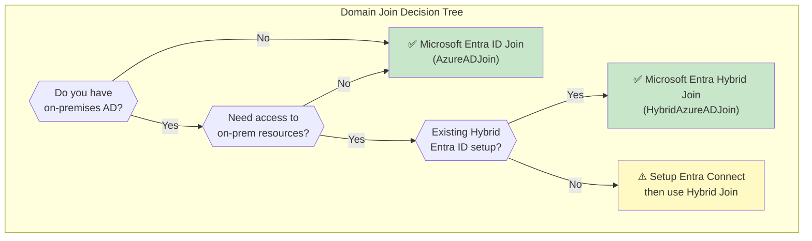
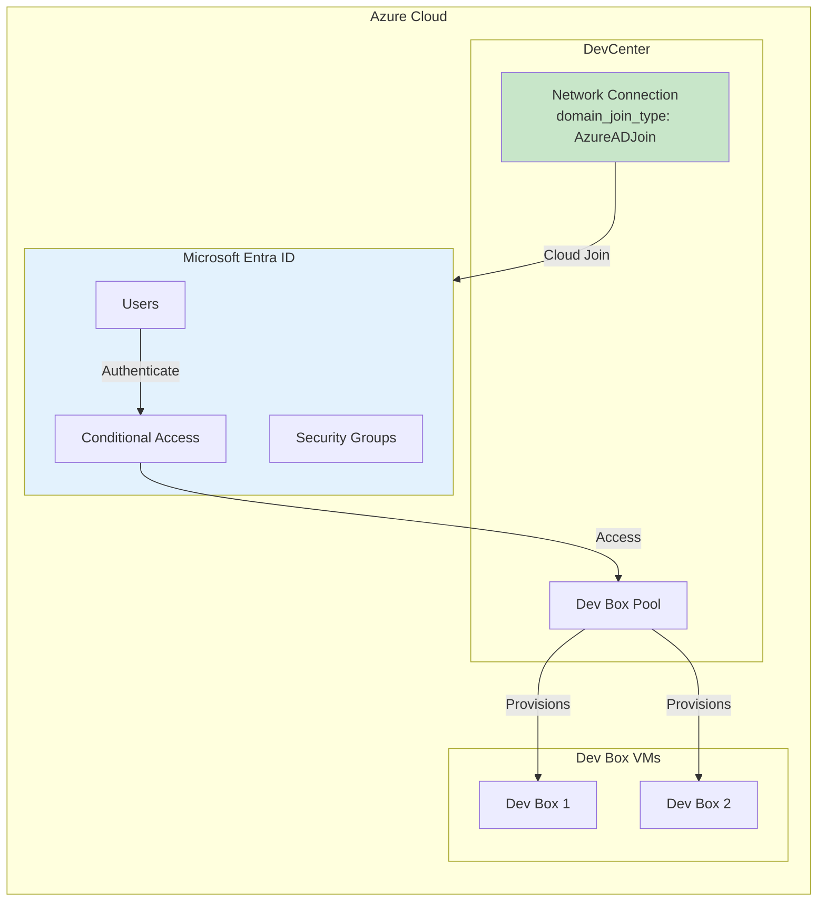
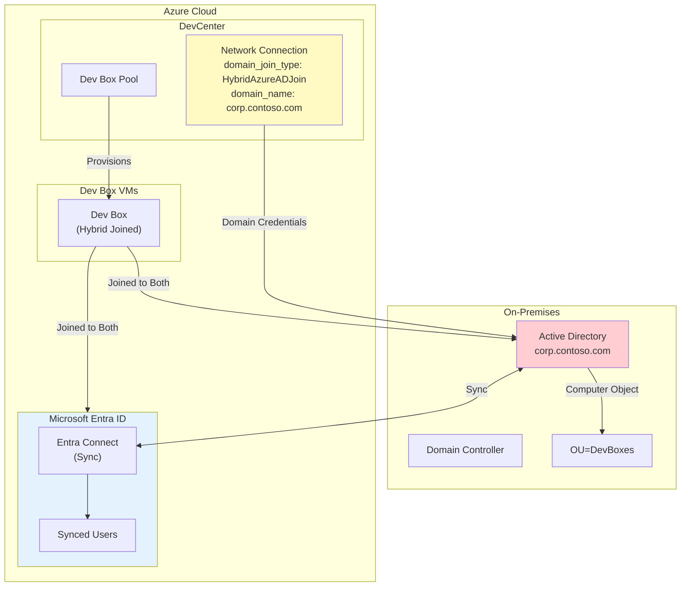
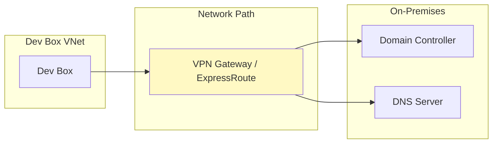

# Domain Join Configuration Guide

**Document Version:** 1.0  
**Last Updated:** January 26, 2026  
**Classification:** Internal  
**Status:** Reference Documentation

---

## Table of Contents

1. [Overview](#overview)
2. [Domain Join Types](#domain-join-types)
3. [Current Configuration](#current-configuration)
4. [Code Changes Required](#code-changes-required)
   - [Microsoft Entra ID Join (Cloud-Only)](#microsoft-entra-id-join-cloud-only)
   - [Microsoft Entra Hybrid Join](#microsoft-entra-hybrid-join)
5. [Architecture Diagrams](#architecture-diagrams)
6. [Prerequisites by Join Type](#prerequisites-by-join-type)
7. [RACI for Domain Join Decision](#raci-for-domain-join-decision)

---

## Overview

Microsoft Dev Box supports two domain join types that determine how Dev Box VMs join your organization's identity infrastructure. The domain join configuration is applied at the **Network Connection** level in Terraform, **NOT** in the Packer image.

### Key Insight

> **Important:** The Security Baseline Packer image prepares Windows for domain join (Azure AD readiness settings, UAC, WinRM, etc.), but the actual domain join type is configured in the Terraform infrastructure code at the network connection level.

---

## Domain Join Types

| Join Type | Description | Use Case |
|-----------|-------------|----------|
| **AzureADJoin** | Cloud-only Microsoft Entra ID join | Organizations fully in the cloud with no on-premises AD |
| **HybridAzureADJoin** | Joined to both on-premises AD and Microsoft Entra ID | Organizations with existing on-premises Active Directory |



---

## Current Configuration

The current codebase is configured for **Microsoft Entra ID Join (cloud-only)**:

### Location: Network Connection Resource

**File:** [infrastructure/modules/devcenter/main.tf](../infrastructure/modules/devcenter/main.tf#L86-L92)

```hcl
# Network Connection
resource "azurerm_dev_center_network_connection" "main" {
  name                = var.network_connection_name
  resource_group_name = var.resource_group_name
  location            = var.location
  domain_join_type    = "AzureADJoin"  # <-- Currently hardcoded
  subnet_id           = var.subnet_id
}
```

### Location: Security Baseline Image (Packer)

**File:** [images/packer/base/security-baseline.pkr.hcl](../images/packer/base/security-baseline.pkr.hcl#L178-L226)

The Packer image contains **Azure AD readiness** provisioners that:
- Configure UAC settings (required for both join types)
- Enable WinRM for management
- Configure Remote Desktop
- Set network profile to Private

> These provisioners prepare Windows for **EITHER** join type. No changes needed in Packer.

---

## Code Changes Required

### Microsoft Entra ID Join (Cloud-Only)

**Current state - No changes required for basic cloud-only join.**

To make this configurable via variable, implement the following changes:

#### Change 1: Add Variable to Module

**File:** `infrastructure/modules/devcenter/main.tf`

```hcl
# ADD this new variable at the top of the file (around line 1)

variable "domain_join_type" {
  description = "The type of domain join for Dev Box. Valid values: 'AzureADJoin' or 'HybridAzureADJoin'"
  type        = string
  default     = "AzureADJoin"

  validation {
    condition     = contains(["AzureADJoin", "HybridAzureADJoin"], var.domain_join_type)
    error_message = "domain_join_type must be either 'AzureADJoin' or 'HybridAzureADJoin'."
  }
}
```

#### Change 2: Update Network Connection Resource

**File:** `infrastructure/modules/devcenter/main.tf` (around line 86-92)

```hcl
# REPLACE the existing network connection resource

# Network Connection
resource "azurerm_dev_center_network_connection" "main" {
  name                = var.network_connection_name
  resource_group_name = var.resource_group_name
  location            = var.location
  domain_join_type    = var.domain_join_type  # <-- Use variable instead of hardcoded value
  subnet_id           = var.subnet_id
}
```

#### Change 3: Add Root Variable

**File:** `infrastructure/variables.tf`

```hcl
# ADD this new variable (e.g., after line 108)

variable "domain_join_type" {
  description = "The type of domain join for Dev Box. Valid values: 'AzureADJoin' for cloud-only or 'HybridAzureADJoin' for hybrid environments with on-premises AD."
  type        = string
  default     = "AzureADJoin"

  validation {
    condition     = contains(["AzureADJoin", "HybridAzureADJoin"], var.domain_join_type)
    error_message = "domain_join_type must be either 'AzureADJoin' or 'HybridAzureADJoin'."
  }
}
```

#### Change 4: Pass Variable to Module

**File:** `infrastructure/main.tf` (in the module call, around line 146)

```hcl
# ADD domain_join_type to the module call

module "devcenter" {
  source = "./modules/devcenter"

  # ... existing parameters ...
  domain_join_type               = var.domain_join_type  # <-- ADD this line
}
```

---

### Microsoft Entra Hybrid Join

Hybrid join requires **additional configuration** including on-premises AD credentials.

#### Additional Variables for Hybrid Join

**File:** `infrastructure/modules/devcenter/main.tf`

```hcl
# ADD these variables for Hybrid Entra Join support

variable "domain_name" {
  description = "The Active Directory domain name for Hybrid Entra Join (e.g., 'corp.contoso.com')"
  type        = string
  default     = null
}

variable "domain_username" {
  description = "The service account UPN for domain join operations (e.g., 'svc-domainjoin@corp.contoso.com')"
  type        = string
  default     = null
  sensitive   = true
}

variable "domain_password" {
  description = "The password for the domain join service account"
  type        = string
  default     = null
  sensitive   = true
}

variable "organizational_unit" {
  description = "The OU distinguished name for placing computer objects (e.g., 'OU=DevBoxes,OU=Computers,DC=corp,DC=contoso,DC=com')"
  type        = string
  default     = ""
}
```

#### Updated Network Connection Resource for Hybrid Join

**File:** `infrastructure/modules/devcenter/main.tf`

```hcl
# REPLACE the network connection resource with this version that supports both join types

resource "azurerm_dev_center_network_connection" "main" {
  name                = var.network_connection_name
  resource_group_name = var.resource_group_name
  location            = var.location
  domain_join_type    = var.domain_join_type
  subnet_id           = var.subnet_id

  # Hybrid Entra Join specific settings (only applied when domain_join_type = "HybridAzureADJoin")
  domain_name       = var.domain_join_type == "HybridAzureADJoin" ? var.domain_name : null
  domain_username   = var.domain_join_type == "HybridAzureADJoin" ? var.domain_username : null
  domain_password   = var.domain_join_type == "HybridAzureADJoin" ? var.domain_password : null
  organization_unit = var.domain_join_type == "HybridAzureADJoin" ? var.organizational_unit : null
}
```

#### Root Variables for Hybrid Join

**File:** `infrastructure/variables.tf`

```hcl
# ADD these variables for Hybrid Entra Join

variable "domain_name" {
  description = "The Active Directory domain name for Hybrid Entra Join"
  type        = string
  default     = null
}

variable "domain_username" {
  description = "Domain join service account UPN"
  type        = string
  default     = null
  sensitive   = true
}

variable "domain_password" {
  description = "Domain join service account password"
  type        = string
  default     = null
  sensitive   = true
}

variable "organizational_unit" {
  description = "OU distinguished name for computer objects"
  type        = string
  default     = ""
}
```

#### Updated terraform.tfvars.example

**File:** `infrastructure/terraform.tfvars.example`

```hcl
# Domain Join Configuration
# --------------------------
# For Microsoft Entra ID Join (cloud-only):
domain_join_type = "AzureADJoin"

# For Microsoft Entra Hybrid Join (with on-premises AD):
# domain_join_type    = "HybridAzureADJoin"
# domain_name         = "corp.contoso.com"
# domain_username     = "svc-domainjoin@corp.contoso.com"
# domain_password     = "USE_KEY_VAULT_REFERENCE"
# organizational_unit = "OU=DevBoxes,OU=Computers,DC=corp,DC=contoso,DC=com"
```

---

## Architecture Diagrams

### Microsoft Entra ID Join (Cloud-Only)



### Microsoft Entra Hybrid Join



---

## Prerequisites by Join Type

### Microsoft Entra ID Join

| Requirement | Status | Notes |
|-------------|--------|-------|
| Microsoft Entra ID tenant | Required | Basic Entra ID |
| Entra ID Premium P1/P2 | Recommended | For Conditional Access, Intune auto-enrollment |
| Network connectivity to Entra ID | Required | HTTPS to *.microsoft.com |
| Intune license | Required | For device management |

### Microsoft Entra Hybrid Join

| Requirement | Status | Notes |
|-------------|--------|-------|
| All Entra ID Join requirements | Required | See above |
| On-premises Active Directory | Required | Windows Server AD DS |
| Microsoft Entra Connect | Required | Sync users and devices |
| Device writeback (Entra Connect) | Required | For hybrid device registration |
| Line-of-sight to Domain Controller | Required | VPN/ExpressRoute from VNet |
| Service account for domain join | Required | With permissions to create computer objects |
| Organizational Unit (OU) | Recommended | For computer object placement |
| DNS resolution to AD | Required | Dev Box must resolve AD domain |

### Network Requirements for Hybrid Join



**Required Ports (Hybrid Join):**

| Port | Protocol | Purpose |
|------|----------|---------|
| 389 | TCP/UDP | LDAP |
| 636 | TCP | LDAPS |
| 88 | TCP/UDP | Kerberos |
| 445 | TCP | SMB |
| 135 | TCP | RPC |
| 49152-65535 | TCP | RPC Dynamic |

---

## Summary of Changes by Layer

| Layer | File(s) | Changes for Entra ID | Changes for Hybrid |
|-------|---------|---------------------|-------------------|
| **Terraform Module** | `modules/devcenter/main.tf` | Add `domain_join_type` variable, update resource | Add all domain-related variables |
| **Terraform Root** | `variables.tf` | Add `domain_join_type` | Add all domain-related variables |
| **Terraform Root** | `main.tf` | Pass `domain_join_type` to module | Pass all domain-related variables |
| **Terraform Config** | `terraform.tfvars` | Set `domain_join_type` | Set all domain configuration |
| **Packer Image** | `security-baseline.pkr.hcl` | **No changes needed** | **No changes needed** |
| **Network** | Azure VNet | Standard config | Add VPN/ExpressRoute to on-prem |
| **Identity** | Entra ID | Standard config | Configure Entra Connect with device writeback |

---

## RACI for Domain Join Decision

| Activity | Infrastructure | Endpoint | Security | Business Unit |
|----------|:-------------:|:--------:|:--------:|:-------------:|
| Domain Join Type Selection | C | R | A | C |
| Hybrid Join Service Account | R | I | A | I |
| OU Structure Design | C | C | A/R | I |
| Network Connectivity (VPN) | A/R | I | C | I |
| Entra Connect Configuration | C | I | A/R | I |
| Testing & Validation | R | A/R | R | I |

---

## Related Documentation

- [Architecture Decision Record](ARCHITECTURE.md)
- [Security Design](SECURITY-DESIGN.md)
- [RACI Matrix](RACI-MATRIX.md)
- [Microsoft Learn: Dev Box Network Connection](https://learn.microsoft.com/azure/dev-box/how-to-configure-network-connections)
- [Microsoft Learn: Hybrid Join Planning](https://learn.microsoft.com/azure/active-directory/devices/hybrid-azuread-join-plan)
