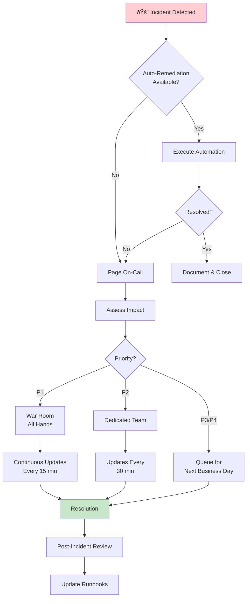

# Operations Guide - Microsoft DevCenter Solution

**Document Version:** 1.0  
**Last Updated:** January 28, 2026  
**Classification:** Internal  
**Status:** Draft

---

## Table of Contents

1. [Overview](#overview)
2. [Daily Operations](#daily-operations)
3. [Weekly Operations](#weekly-operations)
4. [Monthly Operations](#monthly-operations)
5. [Quarterly Operations](#quarterly-operations)
6. [Operational Runbooks](#operational-runbooks)
7. [Monitoring & Alerting](#monitoring--alerting)
8. [Incident Management](#incident-management)
9. [Maintenance Windows](#maintenance-windows)
10. [Operational Metrics & KPIs](#operational-metrics--kpis)

---

## Overview

This Operations Guide provides detailed procedures, schedules, and runbooks for the day-to-day management of the Microsoft DevCenter (Dev Box) solution. It complements the [RACI Matrix](RACI-MATRIX.md) by providing the "how" to the RACI's "who."

> **Microsoft Best Practice Alignment:** This guide follows the [Microsoft Cloud Adoption Framework (CAF) Manage methodology](https://learn.microsoft.com/en-us/azure/cloud-adoption-framework/manage/) and the **RAMP approach** (Ready, Administer, Monitor, Protect) for cloud operations.

### Purpose

- Define recurring operational tasks and schedules
- Provide step-by-step runbooks for common operations
- Establish monitoring and alerting procedures
- Document incident response procedures
- Track operational metrics and KPIs
- **Automate repetitive work** to reduce manual effort and errors
- **Enable continuous improvement** through regular operational reviews

### Scope

| In Scope | Out of Scope |
|----------|--------------|
| DevCenter infrastructure operations | Project-specific development tasks |
| Image lifecycle management | Application code deployments |
| Pool provisioning and maintenance | End-user Dev Box usage |
| Security baseline enforcement | Business application testing |
| Cost monitoring and optimization | Individual developer workflows |

> **For Developers:** If you're a developer building or maintaining team images, see the [Developer Image Guide](DEVELOPER-IMAGE-GUIDE.md) for build procedures, testing, and troubleshooting.

### Shared Responsibility Model

Per [Microsoft CAF guidance](https://learn.microsoft.com/en-us/azure/cloud-adoption-framework/manage/ready-cloud-operations), monitoring responsibilities are split between **Central (Platform)** and **Workload** teams:

| Monitoring Area | Central Team Responsibilities | Workload Team Responsibilities |
|-----------------|------------------------------|--------------------------------|
| **Service Health** | Monitor overall platform health, SLA reporting | Monitor workload-specific resource health |
| **Security** | Define standards, enterprise threat detection | Implement workload-specific security monitoring |
| **Compliance** | Establish policies via Azure Policy | Ensure workload compliance with central policies |
| **Cost** | Set budgets, enterprise-wide cost reporting | Optimize workload-specific spending |
| **Resources** | Monitor shared services, set standard rules | Configure workload-specific logs and dashboards |

---

## Daily Operations

### Infrastructure Team

| Task | Time | Description | Runbook |
|------|------|-------------|---------|
| **Health Check** | 08:00 | Verify DevCenter service health | [RB-001](#rb-001-daily-health-check) |
| **Alert Review** | 08:30 | Review overnight alerts and incidents | [RB-002](#rb-002-alert-triage) |
| **Capacity Check** | 09:00 | Monitor pool capacity and utilization | [RB-003](#rb-003-capacity-monitoring) |
| **Backup Verification** | 10:00 | Verify Terraform state backup success | [RB-004](#rb-004-backup-verification) |
| **Standup Participation** | 10:30 | Daily ops standup with Endpoint Team | - |


### Endpoint Team

| Task | Time | Description | Runbook |
|------|------|-------------|---------|
| **Image Build Status** | 08:00 | Check overnight image build results | [RB-010](#rb-010-image-build-review) |
| **Intune Sync Status** | 08:30 | Verify Intune policy sync health | [RB-011](#rb-011-intune-sync-check) |
| **Definition Validation** | 09:00 | Validate devbox-definitions.json | [RB-012](#rb-012-definition-validation) |
| **Standup Participation** | 10:30 | Daily ops standup with Infrastructure Team | - |

### Security Team

| Task | Time | Description | Runbook |
|------|------|-------------|---------|
| **Security Alert Review** | 08:00 | Review Defender/Sentinel alerts | [RB-020](#rb-020-security-alert-review) |
| **Access Request Queue** | 09:00 | Process pending access requests | [RB-021](#rb-021-access-request-processing) |
| **Compliance Dashboard** | 14:00 | Review compliance posture | [RB-022](#rb-022-compliance-review) |

---

## Weekly Operations

### Monday

| Team | Task | Description | Runbook |
|------|------|-------------|---------|
| Infrastructure | **Terraform Plan Review** | Review any pending infrastructure changes | [RB-100](#rb-100-terraform-plan-review) |
| Endpoint | **Image Pipeline Review** | Review queued image builds for the week | [RB-101](#rb-101-image-pipeline-review) |
| Security | **Weekly Security Review** | Conduct weekly security posture meeting | - |

### Tuesday

| Team | Task | Description | Runbook |
|------|------|-------------|---------|
| Infrastructure | **Network Review** | Review NSG logs and network health | [RB-102](#rb-102-network-review) |
| Endpoint | **Patch Assessment** | Assess pending OS/software patches | [RB-103](#rb-103-patch-assessment) |

### Wednesday

| Team | Task | Description | Runbook |
|------|------|-------------|---------|
| All Teams | **CAB Meeting** | Change Advisory Board (bi-weekly) | - |
| Infrastructure | **Cost Trend Analysis** | Review daily cost trends | [RB-104](#rb-104-cost-analysis) |

### Thursday

| Team | Task | Description | Runbook |
|------|------|-------------|---------|
| Endpoint | **Image Deprecation Review** | Identify images approaching end-of-life | [RB-105](#rb-105-image-deprecation) |
| Security | **Vulnerability Scan Review** | Review weekly vulnerability scan results | [RB-106](#rb-106-vulnerability-review) |

### Friday

| Team | Task | Description | Runbook |
|------|------|-------------|---------|
| Infrastructure | **Capacity Planning** | Update capacity forecasts | [RB-107](#rb-107-capacity-planning) |
| All Teams | **Weekly Summary Report** | Prepare operational summary | [RB-108](#rb-108-weekly-report) |

```mermaid
flowchart TD
    subgraph Week["Weekly Schedule"]
        MON["Monday\n• TF Plan Review\n• Image Pipeline\n• Security Review"]
        TUE["Tuesday\n• Network Review\n• Patch Assessment"]
        WED["Wednesday\n• CAB Meeting\n• Cost Analysis"]
        THU["Thursday\n• Image Deprecation\n• Vuln Scan Review"]
        FRI["Friday\n• Capacity Planning\n• Weekly Report"]
    end
    
    MON --> TUE --> WED --> THU --> FRI
```



---

## Monthly Operations

### First Week of Month

| Day | Team | Task | Description |
|-----|------|------|-------------|
| 1st | Finance/IT | **Cost Review Meeting** | Review previous month's costs by team |
| 2nd | Infrastructure | **Reserved Instance Review** | Assess RI utilization and recommendations |
| 3rd | Endpoint | **Image Lifecycle Report** | Report on image versions and usage |
| 4th | Security | **Access Recertification Kickoff** | Initiate monthly access reviews |
| 5th | All Teams | **Service Level Review** | Review SLA/SLO performance |

### Second Week of Month

| Day | Team | Task | Description |
|-----|------|------|-------------|
| 8th | Endpoint | **Maintenance Window** | Scheduled image updates (if needed) |
| 9th | Infrastructure | **DR Test (if scheduled)** | Monthly DR validation |
| 10th | Security | **Policy Compliance Audit** | Review Intune/CA policy compliance |

### Third Week of Month

| Day | Team | Task | Description |
|-----|------|------|-------------|
| 15th | Info Governance | **Data Classification Review** | Review new data classification requests |
| 16th | Infrastructure | **Performance Baseline Update** | Update performance baselines |
| 17th | Security | **Security Baseline Review** | Assess security baseline effectiveness |

### Fourth Week of Month

| Day | Team | Task | Description |
|-----|------|------|-------------|
| 22nd | All Teams | **Change Freeze Review** | Plan around upcoming holidays/freezes |
| 25th | Infrastructure | **Capacity Forecast Update** | Update 90-day capacity forecast |
| Last Day | All Teams | **Monthly Operations Report** | Publish monthly ops report |

---

## Quarterly Operations

### Q1 (January-March)

| Task | Owner | Timing | Description |
|------|-------|--------|-------------|
| Annual Planning Support | All Teams | January | Support annual IT planning cycle |
| Disaster Recovery Full Test | Infrastructure | February | Full DR failover test |
| Access Recertification (Full) | Security | March | Comprehensive access review |
| Budget Reforecast | Eng/Platform Teams | March | Q1 actuals and reforecast |

### Q2 (April-June)

| Task | Owner | Timing | Description |
|------|-------|--------|-------------|
| Security Assessment | Security | April | External penetration test support |
| Image Strategy Review | Endpoint | May | Review image catalogue strategy |
| Mid-Year Budget Review | All Teams | June | Cost optimization review |

### Q3 (July-September)

| Task | Owner | Timing | Description |
|------|-------|--------|-------------|
| Business Continuity Review | Infrastructure | July | BCP documentation update |
| Compliance Audit Support | All Teams | August | Support annual compliance audits |
| Technology Refresh Planning | Endpoint | September | Plan hardware/software updates |

### Q4 (October-December)

| Task | Owner | Timing | Description |
|------|-------|--------|-------------|
| Year-End Change Freeze | All Teams | December | Reduced changes during holidays |
| Annual Policy Review | Security/IG | November | Update all operational policies |
| Capacity Planning (Annual) | Infrastructure | October | Annual capacity forecast |
| Budget Planning | All Teams | October-November | Next year budget preparation |

---

## Operational Runbooks

### Infrastructure Runbooks

#### RB-001: Daily Health Check

**Purpose:** Verify DevCenter service health each morning  
**Owner:** Infrastructure Team  
**Frequency:** Daily @ 08:00  
**Duration:** 15 minutes

**Prerequisites:**
- Azure Portal access
- DevCenter Reader permissions
- Access to monitoring dashboards

**Procedure:**

```powershell
# Step 1: Check Azure Service Health
# Navigate to: Azure Portal > Service Health > DevCenter

# Step 2: Verify DevCenter Status via CLI
az devcenter admin devcenter list \
    --query "[].{Name:name, State:provisioningState}" \
    --output table

# Step 3: Check all Projects
az devcenter admin project list \
    --query "[].{Name:name, State:provisioningState}" \
    --output table

# Step 4: Verify Network Connections
az devcenter admin network-connection list \
    --query "[].{Name:name, HealthStatus:healthCheckStatus}" \
    --output table
```

**Expected Results:**
| Check | Expected Status |
|-------|----------------|
| DevCenter | Succeeded |
| Projects | Succeeded |
| Network Connections | Passed |

**Escalation:** If any checks fail → [RB-002](#rb-002-alert-triage)

---

#### RB-002: Alert Triage

**Purpose:** Review and triage overnight alerts  
**Owner:** Infrastructure Team  
**Frequency:** Daily @ 08:30  
**Duration:** 30 minutes

**Alert Priority Matrix:**

| Severity | Response Time | Examples |
|----------|--------------|----------|
| Critical (P1) | 15 minutes | Service outage, security breach |
| High (P2) | 1 hour | Pool provisioning failures, network issues |
| Medium (P3) | 4 hours | Capacity warnings, cost anomalies |
| Low (P4) | 24 hours | Informational, optimization suggestions |

**Procedure:**

1. **Review Azure Monitor Alerts**
   ```
   Azure Portal > Monitor > Alerts > Filter: Last 24 hours
   ```

2. **Check Log Analytics Workspace**
   ```kusto
   // DevCenter errors in last 24 hours
   AzureDiagnostics
   | where TimeGenerated > ago(24h)
   | where Category == "DevCenter"
   | where Level == "Error"
   | summarize count() by Resource, OperationName
   ```

3. **Document and Assign**
   - Create tickets for unresolved alerts
   - Assign based on [RACI Matrix](RACI-MATRIX.md)
   - Update status dashboard

---

#### RB-003: Capacity Monitoring

**Purpose:** Monitor pool capacity and utilization  
**Owner:** Infrastructure Team  
**Frequency:** Daily @ 09:00  
**Duration:** 20 minutes

**Capacity Thresholds:**

| Metric | Warning | Critical |
|--------|---------|----------|
| Pool Utilization | > 70% | > 85% |
| Available Quota | < 30% | < 15% |
| Pending Requests | > 10 | > 25 |

**Procedure:**

```powershell
# List all pools with their current usage
$pools = az devcenter admin pool list --project-name "<project>" --output json | ConvertFrom-Json

foreach ($pool in $pools) {
    Write-Host "Pool: $($pool.name)"
    Write-Host "  Status: $($pool.provisioningState)"
    Write-Host "  Dev Box Count: $($pool.devBoxCount)"
    Write-Host "---"
}
```

**Actions:**
- If utilization > 70%: Review with Business Platform Teams
- If utilization > 85%: Initiate capacity expansion request
- If pending requests > 25: Escalate to management

---

#### RB-004: Backup Verification

**Purpose:** Verify Terraform state and configuration backups  
**Owner:** Infrastructure Team  
**Frequency:** Daily @ 10:00  
**Duration:** 10 minutes

**Procedure:**

1. **Verify Terraform State Backend**
   ```powershell
   # Check blob storage for state file
   az storage blob show \
       --account-name "<storage-account>" \
       --container-name "tfstate" \
       --name "terraform.tfstate" \
       --query "{LastModified:properties.lastModified, Size:properties.contentLength}"
   ```

2. **Verify State Lock**
   ```powershell
   # Ensure no stale locks
   az storage blob lease show \
       --account-name "<storage-account>" \
       --container-name "tfstate" \
       --blob-name "terraform.tfstate"
   ```

3. **Document in Daily Log**
   - Record last backup time
   - Note any anomalies

---

### Endpoint Team Runbooks

#### RB-010: Image Build Review

**Purpose:** Review overnight image build results  
**Owner:** Endpoint Team  
**Frequency:** Daily @ 08:00  
**Duration:** 20 minutes

**Procedure:**

1. **Check CI/CD Pipeline**
   - Review Azure DevOps / GitHub Actions for image builds
   - Note any failed builds

2. **Verify Gallery Images**
   ```powershell
   # List recent image versions
   az sig image-version list \
       --gallery-name "<gallery>" \
       --gallery-image-definition "<image-def>" \
       --resource-group "<rg>" \
       --query "[?publishingProfile.publishedDate > '$(Get-Date).AddDays(-1).ToString('yyyy-MM-dd'))']"
   ```

3. **Validate Build Artifacts**
   - Check Packer logs for warnings
   - Verify security baseline inclusion
   - Confirm provisioner success

**Build Failure Actions:**

| Failure Type | Action |
|--------------|--------|
| Packer validation | Review template syntax |
| Provisioner failure | Check script logs |
| Gallery publish | Verify permissions and quota |
| Security scan | Escalate to Security Team |

---

#### RB-011: Intune Sync Check

**Purpose:** Verify Intune policy synchronization  
**Owner:** Endpoint Team  
**Frequency:** Daily @ 08:30  
**Duration:** 15 minutes

**Procedure:**

1. **Microsoft Endpoint Manager Admin Center**
   ```
   endpoint.microsoft.com > Devices > Monitor > Device compliance
   ```

2. **Check Policy Deployment Status**
   - Review compliance percentage
   - Identify non-compliant devices
   - Check policy sync timestamps

3. **Common Issues:**

| Issue | Resolution |
|-------|------------|
| Sync pending > 24h | Force device sync |
| Policy conflict | Review policy assignments |
| Certificate error | Renew/reissue certificates |

---

#### RB-012: Definition Validation

**Purpose:** Validate devbox-definitions.json integrity  
**Owner:** Endpoint Team  
**Frequency:** Daily @ 09:00  
**Duration:** 10 minutes

**Procedure:**

```powershell
# Run validation script
.\infrastructure\scripts\00-validate-definitions.ps1

# Expected output: All definitions valid
```

**Validation Checks:**
- JSON syntax valid
- All referenced images exist in gallery
- SKU names are valid
- Storage profiles are correct

---

### Security Team Runbooks

#### RB-020: Security Alert Review

**Purpose:** Review and triage security alerts  
**Owner:** Security Team  
**Frequency:** Daily @ 08:00  
**Duration:** 45 minutes

**Alert Sources:**
- Microsoft Defender for Cloud
- Microsoft Sentinel
- Azure AD Identity Protection
- Conditional Access reports

**Severity Classification:**

| Severity | Response SLA | Examples |
|----------|-------------|----------|
| Critical | 15 min | Active breach, malware detected |
| High | 1 hour | Suspicious sign-in, privilege escalation |
| Medium | 4 hours | Policy violation, unusual activity |
| Low | 24 hours | Informational, best practice deviation |

---

#### RB-021: Access Request Processing

**Purpose:** Process pending access requests  
**Owner:** Security Team  
**Frequency:** Daily @ 09:00  
**Duration:** 30-60 minutes

**Request Types:**

| Type | SLA | Approval Required |
|------|-----|-------------------|
| Standard Pool Access | 4 hours | Auto-approved (if eligible) |
| Premium Pool Access | 1 business day | Manager + Security |
| Admin Access | 2 business days | Director + Security |
| Emergency Access | 1 hour | Security Manager |

**Procedure:**

1. Review pending requests in ticketing system
2. Verify requestor identity and manager approval
3. Check business justification
4. Apply principle of least privilege
5. Set access expiration (time-bound access)
6. Document decision and notify requestor

---

#### RB-022: Compliance Review

**Purpose:** Review daily compliance posture  
**Owner:** Security Team  
**Frequency:** Daily @ 14:00  
**Duration:** 20 minutes

**Compliance Checks:**

```kusto
// Non-compliant resources
SecurityRecommendation
| where TimeGenerated > ago(24h)
| where State == "Unhealthy"
| summarize count() by RecommendationDisplayName
| order by count_ desc
```

**Dashboard Review:**
- Secure Score trend
- Non-compliant resource count
- Policy compliance percentage
- Conditional Access failures

---

## Monitoring & Alerting

> **Microsoft Best Practice:** Use [Azure Monitor](https://learn.microsoft.com/en-us/azure/azure-monitor/overview) as your central monitoring platform. Configure [Azure Monitor Baseline Alerts (AMBA)](https://learn.microsoft.com/en-us/azure/cloud-adoption-framework/ready/landing-zone/design-area/management-monitor) as a starting point.

### Monitoring Strategy (Per CAF)


### Alert Configuration

> **Note:** Use [dynamic thresholds](https://learn.microsoft.com/en-us/azure/azure-monitor/alerts/alerts-dynamic-thresholds) where possible to reduce false positives.

| Alert Name | Condition | Severity | Team | Azure Monitor Rule Type |
|------------|-----------|----------|------|------------------------|
| DevCenter Unhealthy | Health != Healthy | Critical | Infrastructure | Resource Health |
| Pool Capacity Warning | Utilization > 70% | Warning | Infrastructure | Metric (dynamic) |
| Pool Capacity Critical | Utilization > 85% | Critical | Infrastructure | Metric |
| Image Build Failure | Build Status = Failed | High | Endpoint | Log Search |
| Network Connection Unhealthy | Health Check Failed | Critical | Infrastructure | Resource Health |
| Cost Anomaly | Spend > 120% forecast | Medium | Infrastructure + BU | Cost Management |
| Security Baseline Drift | Compliance < 95% | High | Security | Azure Policy |
| Failed Sign-ins Spike | > 50 in 1 hour | High | Security | Microsoft Sentinel |
| Defender Alert | Any High/Critical | High | Security | Defender for Cloud |

### Monitoring Dashboards

| Dashboard | Owner | Refresh Rate | Purpose |
|-----------|-------|--------------|---------|
| DevCenter Operations | Infrastructure | 5 min | Overall service health |
| Image Pipeline | Endpoint | 15 min | Build status and gallery |
| Security Posture | Security | 15 min | Compliance and threats |
| Cost Analytics | Infrastructure | Daily | Spend tracking |
| User Adoption | Business | Weekly | Usage metrics |

### Log Analytics Queries

**DevCenter Error Summary:**
```kusto
AzureDiagnostics
| where ResourceProvider == "MICROSOFT.DEVCENTER"
| where Level == "Error"
| summarize ErrorCount=count() by bin(TimeGenerated, 1h), OperationName
| render timechart
```

**Pool Utilization Trend:**
```kusto
AzureMetrics
| where ResourceProvider == "Microsoft.DevCenter"
| where MetricName == "DevBoxCount"
| summarize AvgCount=avg(Total) by bin(TimeGenerated, 1h), Resource
| render timechart
```

---

## Incident Management

> **Microsoft Best Practice:** Follow the [Well-Architected Framework incident management guidance](https://learn.microsoft.com/en-us/azure/well-architected/design-guides/incident-management) and integrate with Azure Monitor for automated incident creation.

### Incident Management Principles (Per Microsoft CAF)

1. **Prioritize recovery over discovery** - Restore operations quickly, investigate root cause later
2. **Automate detection and response** - Use Azure Automation runbooks for common remediation
3. **Maintain clear communication** - Designate a communications manager during incidents
4. **Conduct post-incident reviews** - Every incident is a learning opportunity

### Incident Classification

| Priority | Impact | Response | Resolution Target | Communication Frequency |
|----------|--------|----------|-------------------|------------------------|
| P1 - Critical | Service outage, all users affected | 15 min | 2 hours | Every 15 min |
| P2 - High | Major feature unavailable, many users | 30 min | 4 hours | Every 30 min |
| P3 - Medium | Partial degradation, some users | 2 hours | 8 hours | Every 2 hours |
| P4 - Low | Minor issue, workaround available | 4 hours | 24 hours | Daily |

### Incident Response Flow



### Communication Templates

**P1 Incident - Initial Notification:**
```
SUBJECT: [P1 INCIDENT] DevCenter - <Brief Description>

Impact: <Description of user impact>
Status: Investigating
Started: <Time>
Next Update: <Time + 15 min>

Teams Engaged: Infrastructure, <others>
Bridge: <Teams/Zoom link>
```

**P1 Incident - Resolution:**
```
SUBJECT: [RESOLVED] DevCenter - <Brief Description>

Resolution: <What fixed it>
Duration: <Start time> to <End time>
Root Cause: <Brief RCA>
Post-Incident Review: <Scheduled date/time>
```

### Post-Incident Review (Blameless Retrospective)

> **Microsoft Best Practice:** Conduct retrospectives after every incident. The goal is to identify actionable improvements, not assign blame.

**Review Template:**

| Section | Content |
|---------|----------|
| **Incident Summary** | What happened, impact, duration |
| **Timeline** | Key events with timestamps |
| **What Went Well** | Effective responses, tools that helped |
| **What Could Be Improved** | Gaps in detection, response, or communication |
| **Action Items** | Specific improvements with owners and due dates |

**Action Item Categories:**

1. **Response Plan Enhancements** - Update processes or procedures
2. **Observability Improvements** - Adjust thresholds, add monitoring, implement alerts
3. **Workload Remediation** - Address vulnerabilities exposed during incident
4. **Automation Opportunities** - Automate manual steps that slowed response

---

## Maintenance Windows

### Standard Maintenance Windows

| Window | Day | Time (UTC) | Duration | Type |
|--------|-----|------------|----------|------|
| Image Updates | Tuesday | 02:00-06:00 | 4 hours | Planned |
| Infrastructure | Wednesday | 02:00-04:00 | 2 hours | Planned |
| Security Patches | Thursday | 02:00-06:00 | 4 hours | Planned |
| Emergency | Any | ASAP | Variable | Unplanned |

### Maintenance Notification Requirements

| Change Type | Notice Required | Approval |
|-------------|----------------|----------|
| Standard (pre-approved) | 24 hours | Auto |
| Normal | 5 business days | CAB |
| Major | 2 weeks | CAB + Director |
| Emergency | ASAP (post-approval OK) | Security Manager |

### Change Freeze Periods

| Period | Dates | Exceptions |
|--------|-------|------------|
| Year-End | Dec 15 - Jan 5 | Security-critical only |
| Quarter-End | Last 3 days | Security-critical only |
| Major Events | As announced | None |

---

## Operational Metrics & KPIs

> **Microsoft Best Practice:** Define [Service Level Indicators (SLIs)](https://learn.microsoft.com/en-us/azure/cloud-adoption-framework/scenarios/cloud-scale-analytics/manage-observability) to measure service quality, and set [Service Level Objectives (SLOs)](https://learn.microsoft.com/en-us/azure/well-architected/reliability/metrics) as target values.

### Service Level Indicators (SLIs) → Objectives (SLOs)

| SLI (What We Measure) | SLO (Target) | Measurement Tool | Error Budget |
|-----------------------|--------------|------------------|---------------|
| DevCenter Availability | 99.9% | Azure Service Health | 8.76 hrs/year |
| Pool Provisioning Success Rate | 99% | Azure Monitor Logs | 1% failures allowed |
| Image Build Success Rate | 95% | CI/CD Pipeline Metrics | 5% failures allowed |
| Mean Time to Provision | < 30 min (p95) | Application Insights | 5% > 30 min allowed |
| Security Compliance Rate | > 98% | Defender for Cloud | 2% non-compliance allowed |
| Incident Response (P1) | < 15 min | ITSM System | SLA breach if exceeded |
| Incident Resolution (P1) | < 2 hours | ITSM System | SLA breach if exceeded |

### Availability Targets Reference

| Objective | Noncompliance per Month | Noncompliance per Year |
|-----------|------------------------|------------------------|
| 99% | 7.20 hours | 3.65 days |
| 99.9% | 43.20 minutes | 8.76 hours |
| 99.95% | 21.60 minutes | 4.38 hours |
| 99.99% | 4.32 minutes | 52.56 minutes |

### Monthly KPI Dashboard

| KPI | Formula | Target | Owner |
|-----|---------|--------|-------|
| **Availability** | Uptime / Total Time | 99.9% | Infrastructure |
| **MTTR** | Total downtime / Incidents | < 30 min | Infrastructure |
| **Change Success Rate** | Successful / Total Changes | > 95% | All Teams |
| **Image Freshness** | Images < 30 days / Total | > 90% | Endpoint |
| **Cost Variance** | Actual / Budget | ± 10% | All Teams |
| **User Satisfaction** | Survey Score | > 4.0/5.0 | All Teams |

### Reporting Schedule

| Report | Frequency | Audience | Owner |
|--------|-----------|----------|-------|
| Daily Operations Summary | Daily | Ops Teams | Infrastructure |
| Weekly Status Report | Weekly | IT Leadership | Infrastructure |
| Monthly Operations Review | Monthly | IT + Business | All Teams |
| Quarterly Business Review | Quarterly | Executives | All Teams |

---

## Appendix: Quick Reference

### Key Contacts

| Role | Team | Escalation Path |
|------|------|-----------------|
| Infrastructure On-Call | Infrastructure | PagerDuty → Slack #devbox-ops |
| Security On-Call | Security | PagerDuty → Slack #security-alerts |
| Endpoint On-Call | Endpoint | PagerDuty → Slack #devbox-ops |

### Important Links

| Resource | URL |
|----------|-----|
| Azure Portal | portal.azure.com |
| DevCenter Admin | portal.azure.com/#blade/HubsExtension/BrowseResource/resourceType/Microsoft.DevCenter |
| Monitoring Dashboard | <internal-dashboard-url> |
| Runbook Library | <internal-wiki-url> |
| On-Call Schedule | <pagerduty-schedule-url> |

### Azure Operations Tools Reference

| Category | Tool | Purpose |
|----------|------|----------|
| **Central Monitoring** | [Azure Monitor](https://learn.microsoft.com/en-us/azure/azure-monitor/overview) | Central telemetry collection platform |
| **Service Health** | [Azure Service Health](https://learn.microsoft.com/en-us/azure/service-health/overview) | Platform outages and maintenance alerts |
| **Resource Health** | [Azure Resource Health](https://learn.microsoft.com/en-us/azure/service-health/resource-health-overview) | Individual resource health tracking |
| **Security** | [Microsoft Defender for Cloud](https://learn.microsoft.com/en-us/azure/defender-for-cloud/) | Threat detection and security posture |
| **SIEM/SOAR** | [Microsoft Sentinel](https://learn.microsoft.com/en-us/azure/sentinel/overview) | Security analytics and automation |
| **Compliance** | [Azure Policy](https://learn.microsoft.com/en-us/azure/governance/policy/overview) | Governance and compliance enforcement |
| **Cost** | [Microsoft Cost Management](https://learn.microsoft.com/en-us/azure/cost-management-billing/) | Budget tracking and optimization |
| **Automation** | [Azure Automation](https://learn.microsoft.com/en-us/azure/automation/overview) | Runbook execution and auto-remediation |
| **Logs** | [Log Analytics](https://learn.microsoft.com/en-us/azure/azure-monitor/logs/log-analytics-overview) | Log storage and KQL queries |
| **Visualization** | [Azure Workbooks](https://learn.microsoft.com/en-us/azure/azure-monitor/visualize/workbooks-overview) | Custom dashboards and reports |

### Related Documents

- [RACI Matrix](RACI-MATRIX.md) - Who does what
- [Architecture](ARCHITECTURE.md) - System design
- [Workflows](WORKFLOWS.md) - Process diagrams
- [Security Design](SECURITY-DESIGN.md) - Security architecture
- [Cost and Access Control](COST-AND-ACCESS-CONTROL.md) - Financial governance

### Microsoft Documentation References

- [Cloud Adoption Framework - Manage Methodology](https://learn.microsoft.com/en-us/azure/cloud-adoption-framework/manage/)
- [CAF - Ready Your Cloud Operations](https://learn.microsoft.com/en-us/azure/cloud-adoption-framework/manage/ready-cloud-operations)
- [Well-Architected Framework - Incident Management](https://learn.microsoft.com/en-us/azure/well-architected/design-guides/incident-management)
- [Azure Monitor Best Practices](https://learn.microsoft.com/en-us/azure/azure-monitor/best-practices)
- [Azure Monitor Baseline Alerts (AMBA)](https://learn.microsoft.com/en-us/azure/cloud-adoption-framework/ready/landing-zone/design-area/management-monitor)

---

## Document Control

| Version | Date | Author | Changes |
|---------|------|--------|---------|
| 1.0 | January 28, 2026 | Operations Team | Initial release || 1.1 | January 28, 2026 | Operations Team | Aligned with Microsoft CAF RAMP methodology; Added shared responsibility model; Updated monitoring with Azure tooling references; Added post-incident review process; Added SLI/SLO definitions with error budgets; Added Azure tools reference table |