# RACI Matrix - Microsoft DevCenter Solution

**Document Version:** 1.0  
**Last Updated:** January 26, 2026  
**Classification:** Internal  
**Status:** Draft

---

## Table of Contents

1. [Overview](#overview)
2. [RACI Legend](#raci-legend)
3. [Team Definitions](#team-definitions)
4. [RACI Matrix by Domain](#raci-matrix-by-domain)
   - [Infrastructure Management](#infrastructure-management)
   - [Security & Compliance](#security--compliance)
   - [Cost Management](#cost-management)
   - [Governance](#governance)
   - [Resiliency & Operations](#resiliency--operations)
   - [Image Management](#image-management)
5. [Escalation Matrix](#escalation-matrix)
6. [Decision Flow Diagrams](#decision-flow-diagrams)
7. [Change Management Process](#change-management-process)

---

## Overview

This RACI document defines the roles and responsibilities for managing the Microsoft DevCenter (Dev Box) solution across four key teams. The matrix ensures clear accountability, reduces ambiguity, and supports compliance requirements.

### Purpose

- Establish clear ownership boundaries between teams
- Define decision-making authority for each activity
- Support audit and compliance requirements
- Enable efficient change management processes
- Minimize operational conflicts and delays

---

## RACI Legend

| Code | Role | Definition |
|------|------|------------|
| **R** | Responsible | The person(s) who perform the work to achieve the task. There can be multiple R's per task. |
| **A** | Accountable | The single person who is ultimately answerable for the task completion. Only ONE per task. |
| **C** | Consulted | Person(s) whose opinions are sought; two-way communication required before decisions. |
| **I** | Informed | Person(s) who are kept informed of progress/decisions; one-way communication. |
| **-** | Not Involved | No involvement in this activity. |

### RACI Best Practices Applied

```mermaid
flowchart TD
    subgraph Rules["RACI Rules Applied"]
        R1["✅ Every task has exactly ONE Accountable (A)"]
        R2["✅ Every task has at least ONE Responsible (R)"]
        R3["✅ Accountable person has authority to make final decisions"]
        R4["✅ Minimize C's and I's to reduce communication overhead"]
        R5["✅ R and A can be the same person/team"]
    end
```

---

## Team Definitions

### Team Structure Overview

```mermaid
flowchart TB
    subgraph Organization["Organization Structure"]
        direction TB
        
        subgraph IT["IT Department"]
            INFRA["🔧 Infrastructure Team"]
            SEC["🔒 Security Team"]
            END["💻 Endpoint Team"]
        end
        
        subgraph BU["Business Units"]
            DEV["👨‍💻 Development Teams"]
            PM["📊 Project Managers"]
            FIN["💰 Finance/Chargeback"]
        end
    end
    
    INFRA --> |"Manages"| DC["DevCenter"]
    INFRA --> |"Manages"| NET["Networking"]
    SEC --> |"Enforces"| POL["Policies"]
    END --> |"Manages"| IMG["Images"]
    END --> |"Manages"| INT["Intune"]
    DEV --> |"Consumes"| DB["Dev Boxes"]
```

### Team Responsibilities Summary

| Team | Primary Domain | Key Systems |
|------|---------------|-------------|
| **Infrastructure Team** | Azure resources, networking, Terraform deployment | DevCenter, VNet, Azure Compute Gallery, Terraform State |
| **Endpoint Team** | Device management, image lifecycle, Intune policies | Packer images, Intune, Dev Box definitions |
| **Security Team** | Security policies, compliance, access controls | Entra ID, RBAC, NSG, Defender, Conditional Access |
| **Business Units** | Requirements, consumption, budget ownership | Dev Box usage, project requirements, cost centers |

---

## RACI Matrix by Domain

### Infrastructure Management

Activities related to core Azure infrastructure deployment and management.

| Activity | Infrastructure | Endpoint | Security | Business Units |
|----------|:-------------:|:--------:|:--------:|:--------------:|
| **DevCenter Deployment** | A/R | I | C | I |
| **Project Creation** | A/R | I | C | C |
| **Virtual Network Design** | A/R | C | C | I |
| **Network Connections Setup** | A/R | C | C | I |
| **Azure Compute Gallery Management** | A/R | C | I | I |
| **Terraform State Management** | A/R | I | C | - |
| **Infrastructure Monitoring** | A/R | I | C | I |
| **Capacity Planning** | A/R | C | I | C |
| **Disaster Recovery Planning** | A/R | C | C | I |
| **Azure Region Selection** | A/R | C | C | C |
| **Resource Tagging Strategy** | A/R | R | C | C |

### Security & Compliance

Activities related to security controls, compliance, and access management.

| Activity | Infrastructure | Endpoint | Security | Business Units |
|----------|:-------------:|:--------:|:--------:|:--------------:|
| **Security Baseline Definition** | C | R | A/R | I |
| **RBAC Configuration** | R | I | A/R | C |
| **Conditional Access Policies** | I | C | A/R | I |
| **Network Security Groups (NSG)** | R | I | A/R | I |
| **Defender Configuration** | C | R | A/R | I |
| **Security Incident Response** | R | R | A/R | I |
| **Vulnerability Assessment** | C | R | A/R | I |
| **Compliance Audits** | R | R | A/R | C |
| **Service Principal Management** | R | C | A/R | I |
| **Secret/Key Rotation** | R | C | A/R | I |
| **MFA Enforcement** | I | I | A/R | I |
| **Data Classification** | I | I | A/R | C |
| **Security Exception Requests** | C | C | A/R | R |

### Cost Management

Activities related to financial governance, budgeting, and cost optimization.

| Activity | Infrastructure | Endpoint | Security | Business Units |
|----------|:-------------:|:--------:|:--------:|:--------------:|
| **Budget Definition** | C | I | I | A/R |
| **Cost Center Assignment** | R | I | I | A/R |
| **SKU Governance (VM Sizes)** | R | C | C | A/C |
| **Azure Budget Alerts Setup** | A/R | I | I | C |
| **Cost Allocation/Chargeback** | R | I | I | A/R |
| **Reserved Instance Purchasing** | A/R | I | I | C |
| **Auto-Stop Schedule Definition** | C | R | I | A/C |
| **Usage Reporting** | R | R | I | A/I |
| **Cost Optimization Reviews** | R | R | I | A/C |
| **Pool Access Based on Cost Tier** | R | C | C | A/C |
| **Max Dev Boxes Per User Limit** | R | I | C | A/C |

### Governance

Activities related to policies, standards, and operational governance.

| Activity | Infrastructure | Endpoint | Security | Business Units |
|----------|:-------------:|:--------:|:--------:|:--------------:|
| **CODEOWNERS Management** | A/R | R | C | I |
| **Change Management Process** | A/R | R | C | C |
| **Approval Workflows** | R | R | A/R | C |
| **Documentation Standards** | R | R | R | A/I |
| **SLA Definition** | A/R | C | C | C |
| **Service Catalog Management** | A/R | R | C | C |
| **Policy as Code Enforcement** | A/R | C | R | I |
| **Naming Convention Standards** | A/R | R | C | I |
| **Environment Lifecycle Policy** | A/R | R | C | C |
| **Decommissioning Process** | R | R | A/C | C |
| **Audit Trail Management** | R | C | A/R | I |

### Resiliency & Operations

Activities related to reliability, availability, and operational continuity.

| Activity | Infrastructure | Endpoint | Security | Business Units |
|----------|:-------------:|:--------:|:--------:|:--------------:|
| **High Availability Design** | A/R | C | C | I |
| **Backup Strategy** | A/R | C | C | I |
| **Incident Management** | A/R | R | R | I |
| **Problem Management** | A/R | R | C | C |
| **Service Health Monitoring** | A/R | R | I | I |
| **Performance Monitoring** | A/R | R | I | C |
| **Patch Management Strategy** | C | A/R | R | I |
| **Image Update Scheduling** | C | A/R | C | C |
| **Failover Testing** | A/R | R | C | I |
| **RTO/RPO Definition** | A/R | C | C | C |
| **On-Call Rotation** | A/R | R | R | I |
| **Root Cause Analysis** | R | R | R | A/I |

### Image Management

Activities specific to Dev Box image creation and lifecycle management.

| Activity | Infrastructure | Endpoint | Security | Business Units |
|----------|:-------------:|:--------:|:--------:|:--------------:|
| **Base Image Creation** | C | A/R | R | I |
| **Security Baseline in Images** | I | R | A/R | I |
| **Team Image Customization** | I | A/R | C | R |
| **Image Testing & Validation** | I | A/R | R | C |
| **Image Publishing to Gallery** | R | A/R | C | I |
| **Image Deprecation** | C | A/R | C | I |
| **DevBox Definition Management** | C | A/R | I | C |
| **Pool Creation & Configuration** | A/R | C | C | C |
| **Intune Policy Configuration** | I | A/R | R | I |
| **Software License Compliance** | I | R | C | A/R |
| **Application Packaging** | I | A/R | C | R |

---

## Escalation Matrix

### Escalation Levels

### Escalation Triggers

| Scenario | Initial Owner | Escalation Path |
|----------|--------------|-----------------|
| Security Incident | Security Team | Security → CISO → Executive |
| Service Outage | Infrastructure Team | Infra → IT Director → CIO |
| Budget Overrun | Business Unit | BU → Finance → CFO |
| Compliance Violation | Security Team | Security → Compliance → Legal |
| Image Build Failure | Endpoint Team | Endpoint → Infra → IT Director |
| Access Request Denied | Security Team | Security → IT Director → BU Director |

---

## Decision Flow Diagrams

### New Dev Box Request Flow

```mermaid
flowchart TD
    A[🎫 Request Submitted] --> B{Existing Pool<br/>Available?}
    B -->|Yes| C{User Has<br/>Access?}
    B -->|No| D[New Pool Required]
    
    C -->|Yes| E[✅ Self-Service Provision]
    C -->|No| F{Cost Tier<br/>Appropriate?}
    
    F -->|Yes| G[Security Team<br/>Approves Access]
    F -->|No| H[BU Manager<br/>Budget Approval]
    
    H --> G
    G --> I[Infrastructure Team<br/>Grants Access]
    I --> E
    
    D --> J{New Image<br/>Required?}
    J -->|No| K[Endpoint Team<br/>Creates Pool Config]
    J -->|Yes| L[Endpoint Team<br/>Builds Image]
    
    L --> M[Security Team<br/>Validates Baseline]
    M --> K
    K --> N[Infrastructure Team<br/>Deploys Pool]
    N --> C
    
    style A fill:#e1f5fe
    style E fill:#c8e6c9
    style G fill:#fff9c4
    style M fill:#fff9c4
```

### Change Management Flow

### Security Exception Flow

```mermaid
flowchart TD
    A[🔐 Exception Request] --> B[Business Unit<br/>Documents Justification]
    B --> C[Security Team<br/>Risk Assessment]
    C --> D{Risk Level?}
    
    D -->|Low| E[Security Manager<br/>Approves]
    D -->|Medium| F[Security Director<br/>Reviews]
    D -->|High| G[CISO<br/>Reviews]
    
    F --> H{Acceptable<br/>Risk?}
    G --> I{Business<br/>Critical?}
    
    H -->|Yes| J[Approve with<br/>Compensating Controls]
    H -->|No| K[❌ Deny Request]
    
    I -->|Yes| L[Executive<br/>Approval Required]
    I -->|No| K
    
    L --> M{Approved?}
    M -->|Yes| J
    M -->|No| K
    
    E --> N[Document Exception]
    J --> N
    N --> O[Set Review Date]
    O --> P[✅ Implement]
    
    style A fill:#e1f5fe
    style P fill:#c8e6c9
    style K fill:#ffcdd2
```

---

## Change Management Process

### Change Categories

| Category | Description | Approval Required | Lead Time |
|----------|-------------|-------------------|-----------|
| **Standard** | Pre-approved, low-risk changes (e.g., new user access) | Auto-approved | Same day |
| **Normal** | Moderate changes following standard process | Team Lead + CAB | 5 business days |
| **Emergency** | Critical fixes or security patches | Expedited CAB | < 24 hours |
| **Major** | Significant infrastructure or security changes | Director + CAB | 2-4 weeks |

### Change Advisory Board (CAB) Composition

### Approval Matrix by Change Type

| Change Type | Infrastructure | Endpoint | Security | Business Unit |
|-------------|:-------------:|:--------:|:--------:|:-------------:|
| New DevCenter Project | A | I | C | R |
| Network Configuration | A | I | C | I |
| New Dev Box Pool | C | A | C | R |
| Image Security Update | I | R | A | I |
| RBAC Permission Change | R | I | A | C |
| Budget Increase Request | I | I | I | A |
| New Team Image | I | A | C | R |
| Emergency Security Patch | R | R | A | I |

---

## Communication Matrix

### Regular Communication Cadence

| Meeting | Frequency | Attendees | Purpose |
|---------|-----------|-----------|---------|
| **Operations Standup** | Daily | Infra, Endpoint | Daily operational health |
| **Security Review** | Weekly | Security, Infra Lead, Endpoint Lead | Security posture review |
| **Cost Review** | Monthly | All teams + Finance | Budget tracking & optimization |
| **CAB Meeting** | Bi-weekly | CAB members | Change approvals |
| **Governance Review** | Quarterly | Directors + All Leads | Policy & compliance review |
| **Business Review** | Quarterly | IT Leadership + BU Directors | Strategic alignment |

### Communication Channels

```mermaid
flowchart TD
    subgraph Channels["Communication Channels"]
        direction LR
        EMG["🚨 Emergency: PagerDuty + Teams Channel"]
        URG["⚠️ Urgent: Teams Channel + Email"]
        NRM["📧 Normal: Email + Tickets"]
        INFO["📋 Informational: Wiki + Dashboard"]
    end
```

---

## Appendix: Quick Reference Cards

### Infrastructure Team Quick Reference

| When... | Action | Inform |
|---------|--------|--------|
| DevCenter issue reported | Investigate and resolve | Security, affected BU |
| Capacity threshold hit | Scale resources | BU, Finance |
| Network change needed | Submit CAB request | Security, Endpoint |
| New project requested | Create after BU approval | Security, Endpoint, BU |

### Endpoint Team Quick Reference

| When... | Action | Inform |
|---------|--------|--------|
| New image requested | Build and test | Security (for validation) |
| Image vulnerability found | Patch and rebuild | Security, Infrastructure |
| Intune policy change needed | Submit for Security review | Security |
| Software request from BU | Evaluate and package | Security (if new software) |

### Security Team Quick Reference

| When... | Action | Inform |
|---------|--------|--------|
| Security incident detected | Initiate incident response | All teams |
| Access request received | Evaluate and approve/deny | Requestor, Infrastructure |
| Compliance audit scheduled | Coordinate evidence collection | All teams |
| Vulnerability disclosed | Assess impact, coordinate patching | Endpoint, Infrastructure |

### Business Unit Quick Reference

| When... | Action | Inform |
|---------|--------|--------|
| New Dev Box needed | Submit request with justification | Infrastructure |
| Budget concern | Escalate to Finance | Infrastructure |
| Access issue | Contact Security via ticket | Security |
| New requirements | Submit through intake process | All IT teams |

---

## Document Control

| Version | Date | Author | Changes |
|---------|------|--------|---------|
| 1.0 | January 26, 2026 | Operations Team | Initial release |

---

## Related Documents

- [Architecture Decision Record](ARCHITECTURE.md)
- [Cost and Access Control Guide](COST-AND-ACCESS-CONTROL.md)
- [Security Architecture Design](SECURITY-DESIGN.md)
- [Operational Workflows](WORKFLOWS.md)
