# RACI Matrix - Microsoft DevCenter Solution

**Document Version:** 1.1  
**Last Updated:** January 28, 2026  
**Classification:** Internal  
**Status:** Draft

---

## Table of Contents

1. [Overview](#overview)
2. [RACI Legend](#raci-legend)
3. [Team Definitions](#team-definitions)
4. [RACI Matrix by Domain](#raci-matrix-by-domain)
   - [Infrastructure Management](#infrastructure-management)
   - [Security & Compliance](#security--compliance)
   - [Cost Management](#cost-management)
   - [Governance](#governance)
   - [Resiliency & Operations](#resiliency--operations)
   - [Image Management](#image-management)
5. [Escalation Matrix](#escalation-matrix)
6. [Decision Flow Diagrams](#decision-flow-diagrams)
7. [Change Management Process](#change-management-process)

---

## Overview

This RACI document defines the roles and responsibilities for managing the Microsoft DevCenter (Dev Box) solution across six key teams. The matrix ensures clear accountability, reduces ambiguity, and supports compliance requirements.

> **Note:** This document distinguishes between **Engineering Teams** (operational/OpEx) and **Business Platform Teams** (project/CapEx) to properly reflect budget ownership and financial approval authority. It also separates **Information Governance (IG)** responsibilities from **Security** to ensure proper data classification authority.

### Purpose

- Establish clear ownership boundaries between teams
- Define decision-making authority for each activity
- Support audit and compliance requirements
- Enable efficient change management processes
- Minimize operational conflicts and delays

---

## RACI Legend

| Code | Role | Definition |
|------|------|------------|
| **R** | Responsible | The person(s) who perform the work to achieve the task. There can be multiple R's per task. |
| **A** | Accountable | The single person who is ultimately answerable for the task completion. Only ONE per task. |
| **C** | Consulted | Person(s) whose opinions are sought; two-way communication required before decisions. |
| **I** | Informed | Person(s) who are kept informed of progress/decisions; one-way communication. |
| **-** | Not Involved | No involvement in this activity. |

### RACI Best Practices Applied

```mermaid
flowchart TD
    subgraph Rules["RACI Rules Applied"]
        R1["✅ Every task has exactly ONE Accountable (A)"]
        R2["✅ Every task has at least ONE Responsible (R)"]
        R3["✅ Accountable person has authority to make final decisions"]
        R4["✅ Minimize C's and I's to reduce communication overhead"]
        R5["✅ R and A can be the same person/team"]
    end
```

---

## Team Definitions

### Team Structure Overview

```mermaid
flowchart TB
    subgraph Organization["Organization Structure"]
        direction TB
        
        subgraph IT["IT Department"]
            INFRA["🔧 Infrastructure Team"]
            SEC["🔒 Security Team"]
            END["💻 Endpoint Team"]
            IG["📋 Info Governance Team"]
        end
        
        subgraph BU["Business Units"]
            direction TB
            subgraph ENG["Engineering Teams (OpEx)"]
                ENGDEV["👨‍💻 Dev Teams"]
                ENGOPS["⚙️ Operations"]
            end
            subgraph BPT["Business Platform Teams (CapEx)"]
                PROJ["📊 Project Teams"]
                PLAT["🏗️ Platform Teams"]
                FIN["💰 Finance"]
            end
        end
    end
    
    INFRA --> |"Manages"| DC["DevCenter"]
    INFRA --> |"Manages"| NET["Networking"]
    SEC --> |"Enforces"| POL["Security Controls"]
    IG --> |"Classifies"| DATA["Data Assets"]
    END --> |"Manages"| IMG["Images"]
    END --> |"Manages"| INT["Intune"]
    ENGDEV --> |"Consumes"| DB["Dev Boxes"]
    PROJ --> |"Funds/Owns"| DB
```

### Team Responsibilities Summary

| Team | Primary Domain | Key Systems | Budget Type |
|------|---------------|-------------|-------------|
| **Infrastructure Team** | Azure resources, networking, Terraform deployment | DevCenter, VNet, Azure Compute Gallery, Terraform State | IT OpEx |
| **Endpoint Team** | Device management, image lifecycle, Intune policies | Packer images, Intune, Dev Box definitions | IT OpEx |
| **Security Team** | Security policies, compliance, access controls | Entra ID, RBAC, NSG, Defender, Conditional Access | IT OpEx |
| **Info Governance (IG) Team** | Data classification, information policies, retention | Data Catalog, Classification Labels, Retention Policies | IT OpEx |
| **Engineering Teams** | Day-to-day development, operational tasks, bug fixes | Dev Box usage, operational tooling | **OpEx** (non-project) |
| **Business Platform Teams** | Project delivery, platform development, strategic initiatives | Dev Box usage, project requirements, cost centers | **CapEx** (project-based) |

### Budget Ownership Distinction

> **Important:** The distinction between Engineering Teams and Business Platform Teams is critical for financial accountability:
>
> | Aspect | Engineering Teams (OpEx) | Business Platform Teams (CapEx) |
> |--------|--------------------------|----------------------------------|
> | **Budget Type** | Operational expenditure | Capital expenditure |
> | **Funding Model** | IT cost center allocation | Project-based funding |
> | **Approval Authority** | Engineering Manager | Project Sponsor / Platform Owner |
> | **Cost Recovery** | Shared services chargeback | Direct project allocation |
> | **Financial Planning** | Annual IT budget cycle | Project business case |
> | **SKU Governance** | Standard tier (pre-approved) | Can request premium tiers |

---

## RACI Matrix by Domain

### Infrastructure Management

Activities related to core Azure infrastructure deployment and management.

| Activity | Infrastructure | Endpoint | Security | Info Governance | Engineering Teams | Business Platform Teams |
|----------|:-------------:|:--------:|:--------:|:---------------:|:-----------------:|:----------------------:|
| **DevCenter Deployment** | A/R | I | C | - | I | I |
| **Project Creation** | A/R | I | C | - | C | C |
| **Virtual Network Design** | A/R | C | C | - | I | I |
| **Network Connections Setup** | A/R | C | C | - | I | I |
| **Azure Compute Gallery Management** | A/R | C | I | - | I | I |
| **Terraform State Management** | A/R | I | C | - | - | - |
| **Infrastructure Monitoring** | A/R | I | C | - | I | I |
| **Capacity Planning** | A/R | C | I | - | C | C |
| **Disaster Recovery Planning** | A/R | C | C | - | I | C |
| **Azure Region Selection** | A/R | C | C | C | C | C |
| **Resource Tagging Strategy** | A/R | R | C | C | C | C |

### Security & Compliance

Activities related to security controls, compliance, and access management.

> **Note:** Data Classification is owned by the Information Governance (IG) team. Security defines the controls that apply to each classification level but does not assign classifications.

| Activity | Infrastructure | Endpoint | Security | Info Governance | Engineering Teams | Business Platform Teams |
|----------|:-------------:|:--------:|:--------:|:---------------:|:-----------------:|:----------------------:|
| **Security Baseline Definition** | C | R | A/R | C | I | I |
| **RBAC Configuration** | R | I | A/R | - | C | C |
| **Conditional Access Policies** | I | C | A/R | - | I | I |
| **Network Security Groups (NSG)** | R | I | A/R | - | I | I |
| **Defender Configuration** | C | R | A/R | - | I | I |
| **Security Incident Response** | R | R | A/R | C | I | I |
| **Vulnerability Assessment** | C | R | A/R | - | I | I |
| **Compliance Audits** | R | R | A/R | R | C | C |
| **Service Principal Management** | R | C | A/R | - | I | I |
| **Secret/Key Rotation** | R | C | A/R | - | I | I |
| **MFA Enforcement** | I | I | A/R | - | I | I |
| **Data Classification** | I | I | C | A/R | C | C |
| **Security Controls per Classification** | C | R | A/R | C | I | I |
| **Security Exception Requests** | C | C | A/R | C | R | R |
| **Data Retention Policy** | I | C | C | A/R | C | C |
| **Information Handling Standards** | I | C | R | A/R | C | C |

### Cost Management

Activities related to financial governance, budgeting, and cost optimization.

> **Important:** Budget ownership differs between Engineering Teams (OpEx) and Business Platform Teams (CapEx):
> - **Engineering Teams:** Budget allocated through IT shared services; Engineering Manager approves within allocation
> - **Business Platform Teams:** Budget tied to project/platform funding; Project Sponsor/Platform Owner has approval authority

| Activity | Infrastructure | Endpoint | Security | Info Governance | Engineering Teams | Business Platform Teams |
|----------|:-------------:|:--------:|:--------:|:---------------:|:-----------------:|:----------------------:|
| **OpEx Budget Definition** | C | I | I | - | A/R | I |
| **CapEx Budget Definition** | C | I | I | - | I | A/R |
| **Cost Center Assignment** | R | I | I | - | A/C | A/R |
| **SKU Governance (VM Sizes)** | R | C | C | - | C | A/C |
| **Premium SKU Request** | R | C | C | - | - | A/R |
| **Azure Budget Alerts Setup** | A/R | I | I | - | C | C |
| **Cost Allocation/Chargeback** | R | I | I | - | A/I | A/R |
| **Reserved Instance Purchasing** | A/R | I | I | - | C | C |
| **Auto-Stop Schedule Definition** | C | R | I | - | A/C | A/C |
| **Usage Reporting** | R | R | I | - | A/I | A/I |
| **Cost Optimization Reviews** | R | R | I | - | A/C | A/C |
| **Pool Access Based on Cost Tier** | R | C | C | - | C | A/C |
| **Max Dev Boxes Per User Limit** | R | I | C | - | A/C | A/C |
| **Project Cost Tracking** | R | I | I | - | I | A/R |
| **Budget Overrun Escalation** | I | I | I | - | A/R | A/R |

### Governance

Activities related to policies, standards, and operational governance.

| Activity | Infrastructure | Endpoint | Security | Info Governance | Engineering Teams | Business Platform Teams |
|----------|:-------------:|:--------:|:--------:|:---------------:|:-----------------:|:----------------------:|
| **CODEOWNERS Management** | A/R | R | C | - | I | I |
| **Change Management Process** | A/R | R | C | C | C | C |
| **Approval Workflows** | R | R | A/R | C | C | C |
| **Documentation Standards** | R | R | R | A/R | I | I |
| **SLA Definition** | A/R | C | C | - | C | C |
| **Service Catalog Management** | A/R | R | C | - | C | C |
| **Policy as Code Enforcement** | A/R | C | R | C | I | I |
| **Naming Convention Standards** | A/R | R | C | C | I | I |
| **Environment Lifecycle Policy** | A/R | R | C | C | C | C |
| **Decommissioning Process** | R | R | A/C | C | C | C |
| **Audit Trail Management** | R | C | A/R | R | I | I |
| **Information Lifecycle Management** | C | C | C | A/R | C | C |

### Resiliency & Operations

Activities related to reliability, availability, and operational continuity.

| Activity | Infrastructure | Endpoint | Security | Info Governance | Engineering Teams | Business Platform Teams |
|----------|:-------------:|:--------:|:--------:|:---------------:|:-----------------:|:----------------------:|
| **High Availability Design** | A/R | C | C | - | I | C |
| **Backup Strategy** | A/R | C | C | C | I | C |
| **Incident Management** | A/R | R | R | I | I | I |
| **Problem Management** | A/R | R | C | - | C | C |
| **Service Health Monitoring** | A/R | R | I | - | I | I |
| **Performance Monitoring** | A/R | R | I | - | C | C |
| **Patch Management Strategy** | C | A/R | R | - | I | I |
| **Image Update Scheduling** | C | A/R | C | - | C | C |
| **Failover Testing** | A/R | R | C | - | I | C |
| **RTO/RPO Definition** | A/R | C | C | C | C | C |
| **On-Call Rotation** | A/R | R | R | - | I | I |
| **Root Cause Analysis** | R | R | R | C | I | A/I |

### Image Management

Activities specific to Dev Box image creation and lifecycle management.

| Activity | Infrastructure | Endpoint | Security | Info Governance | Engineering Teams | Business Platform Teams |
|----------|:-------------:|:--------:|:--------:|:---------------:|:-----------------:|:----------------------:|
| **Base Image Creation** | C | A/R | R | - | I | I |
| **Security Baseline in Images** | I | R | A/R | - | I | I |
| **Team Image Customization** | I | A/R | C | - | R | R |
| **Image Testing & Validation** | I | A/R | R | - | C | C |
| **Image Publishing to Gallery** | R | A/R | C | - | I | I |
| **Image Deprecation** | C | A/R | C | - | I | I |
| **DevBox Definition Management** | C | A/R | I | - | C | C |
| **Pool Creation & Configuration** | A/R | C | C | - | C | C |
| **Intune Policy Configuration** | I | A/R | R | - | I | I |
| **Software License Compliance** | I | R | C | - | A/C | A/R |
| **Application Packaging** | I | A/R | C | - | R | R |

---

## Escalation Matrix

### Escalation Levels

### Escalation Triggers

| Scenario | Initial Owner | Escalation Path |
|----------|--------------|-----------------|
| Security Incident | Security Team | Security → CISO → Executive |
| Service Outage | Infrastructure Team | Infra → IT Director → CIO |
| OpEx Budget Overrun | Engineering Team | Eng Manager → IT Director → CIO |
| CapEx Budget Overrun | Business Platform Team | Project Sponsor → Portfolio Mgmt → CFO |
| Compliance Violation | Security Team | Security → Compliance → Legal |
| Data Classification Dispute | Info Governance Team | IG → Data Officer → Legal |
| Image Build Failure | Endpoint Team | Endpoint → Infra → IT Director |
| Access Request Denied | Security Team | Security → IT Director → BU Director |

---

## Decision Flow Diagrams

### New Dev Box Request Flow

```mermaid
flowchart TD
    A[🎫 Request Submitted] --> B{Existing Pool<br/>Available?}
    B -->|Yes| C{User Has<br/>Access?}
    B -->|No| D[New Pool Required]
    
    C -->|Yes| E[✅ Self-Service Provision]
    C -->|No| F{Cost Tier<br/>Appropriate?}
    
    F -->|Yes| G[Security Team<br/>Approves Access]
    F -->|No| H[BU Manager<br/>Budget Approval]
    
    H --> G
    G --> I[Infrastructure Team<br/>Grants Access]
    I --> E
    
    D --> J{New Image<br/>Required?}
    J -->|No| K[Endpoint Team<br/>Creates Pool Config]
    J -->|Yes| L[Endpoint Team<br/>Builds Image]
    
    L --> M[Security Team<br/>Validates Baseline]
    M --> K
    K --> N[Infrastructure Team<br/>Deploys Pool]
    N --> C
    
    style A fill:#e1f5fe
    style E fill:#c8e6c9
    style G fill:#fff9c4
    style M fill:#fff9c4
```

### Change Management Flow

### Security Exception Flow

```mermaid
flowchart TD
    A[🔐 Exception Request] --> B[Business Unit<br/>Documents Justification]
    B --> C[Security Team<br/>Risk Assessment]
    C --> D{Risk Level?}
    
    D -->|Low| E[Security Manager<br/>Approves]
    D -->|Medium| F[Security Director<br/>Reviews]
    D -->|High| G[CISO<br/>Reviews]
    
    F --> H{Acceptable<br/>Risk?}
    G --> I{Business<br/>Critical?}
    
    H -->|Yes| J[Approve with<br/>Compensating Controls]
    H -->|No| K[❌ Deny Request]
    
    I -->|Yes| L[Executive<br/>Approval Required]
    I -->|No| K
    
    L --> M{Approved?}
    M -->|Yes| J
    M -->|No| K
    
    E --> N[Document Exception]
    J --> N
    N --> O[Set Review Date]
    O --> P[✅ Implement]
    
    style A fill:#e1f5fe
    style P fill:#c8e6c9
    style K fill:#ffcdd2
```

---

## Change Management Process

### Change Categories

| Category | Description | Approval Required | Lead Time |
|----------|-------------|-------------------|-----------|
| **Standard** | Pre-approved, low-risk changes (e.g., new user access) | Auto-approved | Same day |
| **Normal** | Moderate changes following standard process | Team Lead + CAB | 5 business days |
| **Emergency** | Critical fixes or security patches | Expedited CAB | < 24 hours |
| **Major** | Significant infrastructure or security changes | Director + CAB | 2-4 weeks |

### Change Advisory Board (CAB) Composition

### Approval Matrix by Change Type

| Change Type | Infrastructure | Endpoint | Security | Info Governance | Engineering Teams | Business Platform Teams |
|-------------|:-------------:|:--------:|:--------:|:---------------:|:-----------------:|:----------------------:|
| New DevCenter Project | A | I | C | - | C | R |
| Network Configuration | A | I | C | - | I | I |
| New Dev Box Pool | C | A | C | - | R | R |
| Image Security Update | I | R | A | - | I | I |
| RBAC Permission Change | R | I | A | - | C | C |
| OpEx Budget Increase | I | I | I | - | A | - |
| CapEx Budget Increase | I | I | I | - | - | A |
| New Team Image | I | A | C | - | R | R |
| Emergency Security Patch | R | R | A | - | I | I |
| Data Classification Change | I | I | C | A | C | C |

---

## Communication Matrix

### Regular Communication Cadence

| Meeting | Frequency | Attendees | Purpose |
|---------|-----------|-----------|---------|
| **Operations Standup** | Daily | Infra, Endpoint | Daily operational health |
| **Security Review** | Weekly | Security, Infra Lead, Endpoint Lead, IG Lead | Security posture review |
| **Cost Review (OpEx)** | Monthly | IT teams + Engineering Leads | IT operational budget tracking |
| **Cost Review (CapEx)** | Monthly | IT teams + Platform/Project Leads + Finance | Project/platform budget tracking |
| **CAB Meeting** | Bi-weekly | CAB members (all 7 representatives) | Change approvals |
| **Data Governance Review** | Monthly | IG, Security, Compliance | Data classification & handling |
| **Governance Review** | Quarterly | Directors + All Leads | Policy & compliance review |
| **Business Review** | Quarterly | IT Leadership + Engineering + Platform Directors | Strategic alignment |

### Communication Channels

```mermaid
flowchart TD
    subgraph Channels["Communication Channels"]
        direction LR
        EMG["🚨 Emergency: PagerDuty + Teams Channel"]
        URG["⚠️ Urgent: Teams Channel + Email"]
        NRM["📧 Normal: Email + Tickets"]
        INFO["📋 Informational: Wiki + Dashboard"]
    end
```

---

## Appendix: Quick Reference Cards

### Infrastructure Team Quick Reference

| When... | Action | Inform |
|---------|--------|--------|
| DevCenter issue reported | Investigate and resolve | Security, affected BU |
| Capacity threshold hit | Scale resources | BU, Finance |
| Network change needed | Submit CAB request | Security, Endpoint |
| New project requested | Create after BU approval | Security, Endpoint, BU |

### Endpoint Team Quick Reference

| When... | Action | Inform |
|---------|--------|--------|
| New image requested | Build and test | Security (for validation) |
| Image vulnerability found | Patch and rebuild | Security, Infrastructure |
| Intune policy change needed | Submit for Security review | Security |
| Software request from BU | Evaluate and package | Security (if new software) |

### Security Team Quick Reference

| When... | Action | Inform |
|---------|--------|--------|
| Security incident detected | Initiate incident response | All teams |
| Access request received | Evaluate and approve/deny | Requestor, Infrastructure |
| Compliance audit scheduled | Coordinate evidence collection | All teams |
| Vulnerability disclosed | Assess impact, coordinate patching | Endpoint, Infrastructure |

### Info Governance Team Quick Reference

| When... | Action | Inform |
|---------|--------|--------|
| Data classification needed | Assess and assign classification | Security (for controls) |
| Retention policy change | Update policy, communicate | All teams |
| Classification dispute | Review and adjudicate | Requestor, Security |
| New data type identified | Classify and define handling | Security, Endpoint |

### Engineering Teams Quick Reference (OpEx)

| When... | Action | Inform |
|---------|--------|--------|
| New Dev Box needed | Submit request (standard tier) | Infrastructure |
| OpEx budget concern | Escalate to Engineering Manager | IT Director |
| Access issue | Contact Security via ticket | Security |
| Operational requirements | Submit through IT intake | All IT teams |

### Business Platform Teams Quick Reference (CapEx)

| When... | Action | Inform |
|---------|--------|--------|
| New Dev Box needed | Submit request with project justification | Infrastructure, Finance |
| Premium SKU needed | Submit business case to Project Sponsor | Infrastructure, Finance |
| CapEx budget concern | Escalate to Project Sponsor | Portfolio Management |
| Project requirements | Submit through project intake | All IT teams |

---

## Document Control

| Version | Date | Author | Changes |
|---------|------|--------|---------|
| 1.0 | January 26, 2026 | Operations Team | Initial release || 1.1 | January 28, 2026 | Operations Team | Split Business Units into Engineering Teams (OpEx) and Business Platform Teams (CapEx); Added Information Governance (IG) team for data classification; Updated all RACI matrices to 6-team model; Added budget ownership distinction; Updated CAB composition |
---

## Related Documents

- [Architecture Decision Record](ARCHITECTURE.md)
- [Cost and Access Control Guide](COST-AND-ACCESS-CONTROL.md)
- [Security Architecture Design](SECURITY-DESIGN.md)
- [Operational Workflows](WORKFLOWS.md)
