# DevBox Multi-Role Architecture Diagrams

This document provides visual representations of the DevBox architecture, showing how roles, repositories, and Azure resources interact.

## Table of Contents

- [High-Level Architecture](#high-level-architecture)
- [Repository Separation](#repository-separation)
- [Workflow Diagrams](#workflow-diagrams)
- [Role Responsibilities](#role-responsibilities)
- [Security & Compliance Flow](#security--compliance-flow)
- [Network Architecture](#network-architecture)

## High-Level Architecture

**Legend:**
- 🔵 Blue = Infrastructure Repository (Operations)
- 🟡 Yellow = Images Repository (Development Teams)
- 🟢 Green = Azure Resources

## Repository Separation

### Infrastructure Repository (Operations)

**Owner:** @operations-team @network-team @security-team  
**Update Frequency:** Quarterly or as-needed

### Images Repository (Development Teams)

**Owner:** @dev-teams (per team subfolder)  
**Update Frequency:** Weekly or continuous

## Workflow Diagrams

### Image Creation & Deployment

### Infrastructure Deployment

### Definition Update Flow

## Role Responsibilities

### Operations Team

**Key Activities:**
- Deploy core Azure infrastructure
- Build and maintain SecurityBaselineImage
- Configure network connectivity
- Create/update DevBox definitions in Azure
- Sync pools when definitions change
- Monitor compliance and costs

### Development Teams

**Key Activities:**
- Create Packer templates for team needs
- Install team-specific tools (Java, .NET, etc.)
- Configure DevBox specifications (CPU, RAM, storage)
- Test images before production
- Update definitions with new versions
- Submit PRs for approval

### End Users (Developers)

**Key Activities:**
- Browse available Dev Box pools
- Provision Dev Boxes on-demand
- Connect and start development
- Dev Box auto-stops to save costs
- Resume work next day

## Security & Compliance Flow

### Security Baseline Inheritance

```mermaid
graph TD
    A[SecurityBaselineImage v1.0.0] --> B[Mandatory Components]
    
    B --> C[Windows Hardening]
    B --> D[Azure AD Join]
    B --> E[Windows Defender]
    B --> F[Firewall Enabled]
    B --> G[UAC Enabled]
    B --> H[Azure CLI]
    B --> I[Chocolatey]
    
    A --> J[Team Images Inherit]
    
    J --> K[Java DevBox v1.0.2]
    J --> L[.NET DevBox v2.1.0]
    J --> M[VSCode DevBox v1.5.3]
    
    K --> N{Security Validation}
    L --> N
    M --> N
    
    N -->|Pass| O[✓ All Security Intact]
    N -->|Fail| P[✗ Build Fails]
    
    O --> Q[Production Ready]
    P --> R[Fix & Rebuild]
    
    style A fill:#e8f5e9
    style B fill:#ffebee
    style C fill:#ffcdd2
    style D fill:#ffcdd2
    style E fill:#ffcdd2
    style F fill:#ffcdd2
    style G fill:#ffcdd2
    style H fill:#ffcdd2
    style I fill:#ffcdd2
    style J fill:#fff4e1
    style N fill:#fff9c4
    style O fill:#c8e6c9
    style P fill:#ffcdd2
```

### Compliance Validation Process

```mermaid
sequenceDiagram
    autonumber
    participant Build as Packer Build
    participant Image as Custom Image
    participant Check as Security Validation
    participant Ops as Operations Team
    participant Fail as Build Failure

    Build->>Image: Apply team customizations
    Image->>Image: Install Java/IDEs/WSL
    
    Build->>Check: Run compliance provisioner
    
    Check->>Check: ✓ Verify UAC enabled
    Check->>Check: ✓ Verify Defender enabled
    Check->>Check: ✓ Verify Firewall enabled  
    Check->>Check: ✓ Verify Azure CLI present
    Check->>Check: ✓ Verify no disabled security
    
    alt All Checks Pass
        Check->>Build: ✅ Validation passed
        Build->>Image: Proceed to sysprep
        Image->>Image: Generalize & upload
    else Any Check Fails
        Check->>Fail: ❌ Validation failed
        Fail->>Build: Stop build process
        Fail->>Ops: Alert: Security violation detected
        Ops->>Build: Review logs & remediate
    end
```

## Network Architecture

### Network Traffic Flow

## Data Flow

### Image Build Process

### DevBox Provisioning Flow

## CI/CD Integration

```mermaid
graph LR
    subgraph "Images Repository CI/CD"
        A[Git Push] --> B{Branch?}
        B -->|feature| C[Packer Validate]
        B -->|main| D[Packer Build]
        
        C --> E{Valid?}
        E -->|No| F[Fail PR Check]
        E -->|Yes| G[✓ PR Ready]
        
        D --> H[Build Image]
        H --> I[Upload to Gallery]
        I --> J[Trigger Webhook]
    end
    
    subgraph "Infrastructure Repository CI/CD"
        K[Git Push] --> L{Branch?}
        L -->|feature| M[Terraform Plan]
        L -->|main| N[Terraform Apply]
        
        M --> O{Plan Valid?}
        O -->|No| P[Fail PR Check]
        O -->|Yes| Q[✓ PR Ready]
        
        N --> R[Deploy Infrastructure]
        R --> S[Update Resources]
    end
    
    subgraph "Automated Sync"
        J --> T[Webhook Received]
        T --> U[Run 03-create-definitions.ps1]
        U --> V[Run 04-sync-pools.ps1]
        V --> W[Pools Updated]
    end
    
    style C fill:#fff4e1
    style D fill:#fff4e1
    style M fill:#e1f5ff
    style N fill:#e1f5ff
    style W fill:#c8e6c9
```

## Summary

This architecture provides:

- ✅ **Clear Separation** - Infrastructure vs. Development concerns
- ✅ **Independent Operations** - Teams work without blocking each other
- ✅ **Security Enforcement** - Baseline image ensures compliance
- ✅ **Scalability** - Easy to add teams and image types
- ✅ **Auditability** - Git tracks all changes with approvals
- ✅ **Automation** - CI/CD handles builds and deployments
- ✅ **Flexibility** - Teams customize without infrastructure access
- ✅ **Governance** - Operations maintains control of core resources

## Related Documentation

- [Architecture Decision Record (ADR)](./architecture.md) - Rationale and alternatives
- [Main README](../README.md) - Overview and quick start
- [Infrastructure README](../infrastructure/README.md) - Operations team guide
- [Images README](../images/README.md) - Development team guide
